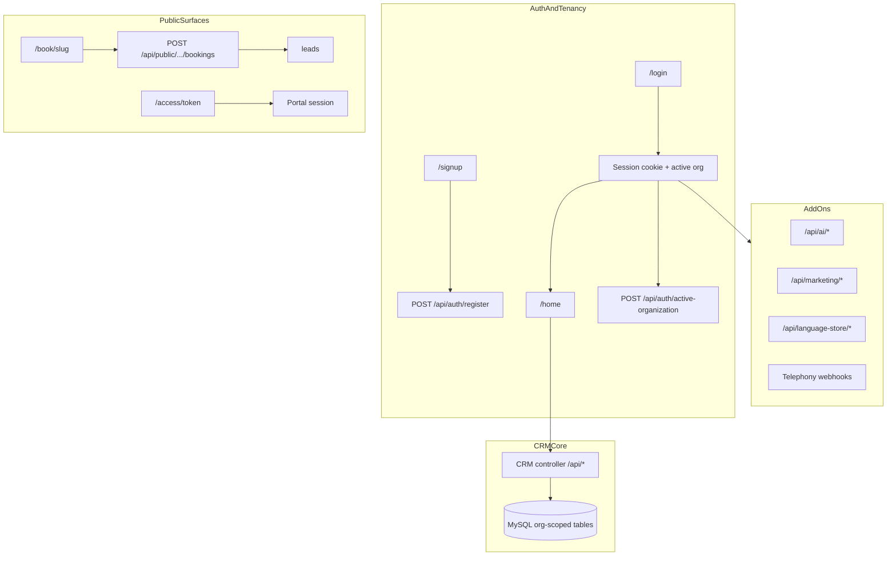

# WizField Built Product Inventory + Working-System Map

> **HISTORICAL inventory snapshot (2026-05-29).**  
> This is **not** a Source of Truth. Current architecture and production verdict live in [WizField_Master_Source_of_Truth.md](WizField_Master_Source_of_Truth.md) and [WIZFIELD_PRODUCTION_CLOSEOUT.md](audit/production-2026-09/WIZFIELD_PRODUCTION_CLOSEOUT.md).  
> Treat rows below as dated working-system evidence. In particular: Home AI is now shipped (not untracked WIP); Stripe runtime is removed (not a pending live-activation step); public-booking durability and payment integrity were closed in the September 2026 closeout.

## Execution addendum (2026-05-29)

Plan todos executed on `SaaS-master` @ `fbcc5b7`:

| Todo | Result | Evidence |
|------|--------|----------|
| P0 core CRM walkthrough | **32/32 PASS** | [`_runtime_harness/p0-core-crm-walkthrough.mjs`](../_runtime_harness/p0-core-crm-walkthrough.mjs), [`p0-walkthrough-latest.json`](../_runtime_harness/p0-walkthrough-latest.json) |
| Reverification smokes | **ALL PASS** | `document-snapshot:isolation:smoke`, `language-store-entitlement:smoke`, `language-store-translation:smoke`, `language-store-snapshot-safety:smoke` |
| Gate 12 matrix (automated local) | **11/11 PASS** | [`_runtime_harness/gate12-reverification-automated.mjs`](../_runtime_harness/gate12-reverification-automated.mjs) |
| AI Chat WIP scope | **EXCLUDE until commit** | [`WizField_AI_Chat_WIP_Scope_Decision.md`](WizField_AI_Chat_WIP_Scope_Decision.md) |

**Infra note:** [`backend/src/load-env.ts`](../backend/src/load-env.ts) added so backend boots (`main.ts` import). Required for verification runs.

**Still recommended:** one human browser pass (form clicks on `/signup`, `/customers/new`, `/book/[slug]`) and production-domain replay per [`WizField_Reverification_Runbook.md`](WizField_Reverification_Runbook.md).

---

## 1. Executive verdict

**PRODUCT MAP CLEAN WITH VERIFICATION GAPS** (core CRM path now exercised locally)

- Core multi-tenant CRM stack is **real and wired**: 52 Next.js routes, 18 Nest modules, 68 entities, 30 migrations; backend + frontend **build PASS**; schema verify **PASS** against live DB `wizfield`.
- **Automated tenant-safety evidence is strong**: isolation smokes (booking, inspections, telephony, copilot, document snapshot, language store) **PASS**; P0 CRM API walkthrough **32/32 PASS**; Gate 12 automated local matrix **11/11 PASS**.
- **Several surfaces are intentionally partial or placeholder** (dispatch disabled, demo warranty page, messaging email “coming soon”, job-detail browser-only setting, draft legal pages)—label during user testing.
- **Remaining gaps:** visual browser form UX not fully clicked; deployed-domain replay; Growth Center OAuth publish; i18n parity; AI Chat WIP excluded per scope decision.
- **Stripe live activation is disabled/removed from active runtime** (owner decision)—not treated as product-map failure.

---

## 2. Current repo state

| Item | Value |
|------|-------|
| **Branch** | `SaaS-master` |
| **Latest commit** | `fbcc5b7` — `test(field-copilot): add runtime safety adversarial QA and emergency hard-stop coverage` |
| **Git status** | **Dirty** — 1 modified tracked file + large untracked set |
| **Modified (tracked)** | [`docs/field-knowledge/manifest/field-knowledge-manifest.v1.json`](docs/field-knowledge/manifest/field-knowledge-manifest.v1.json) |
| **Notable untracked WIP** | `backend/src/ai/general-ai-chat-*`, `backend/src/ai/ai-chat-context-unit-check.ts`, `backend/src/ai/load-env.ts`, `frontend/components/home/ai-chat-panel.tsx`, `frontend/app/settings/ai-usage-panel.tsx`, field-knowledge docs, `docs/runtime-safety-review-pack/`, chatgpt-review-package copies |
| **Immediate stop conditions** | Do not treat untracked AI chat files as released truth until committed/reviewed; do not assume i18n parity is clean (`i18n:check` **FAIL**); do not run live Telnyx/SMS/email in mapping mode; Stripe SaaS billing is not active |

**Docs read (primary paths):**
- [`docs/AI_WORKFLOW_RULES.md`](docs/AI_WORKFLOW_RULES.md) — present
- [`docs/OWNER_FEATURE_CHECKLIST_EN.md`](docs/OWNER_FEATURE_CHECKLIST_EN.md) — present
- `Execute.txt` — **not found**
- Canonical SoT docs under [`docs/`](docs/) — present (plus duplicate copies under `docs/chatgpt-review-package/`)

**Root structure:** `backend/`, `frontend/`, `docs/`, `docker/`, `scripts/`, `_runtime_harness/`, workspace [`package.json`](package.json)

---

## 3. Product module map

Legend — **Verification status:** VERIFIED | BUILT BUT NOT VERIFIED | UI ONLY | BACKEND ONLY | PARTIAL | DISCONNECTED | DEFERRED  
**Risk:** P0 blocks using product | P1 blocks pilot | P2 cleanup | P3 polish

### Core CRM & operations

| Module | Frontend | Backend | Entities / tables | API helpers | Permissions | Env flags | Verification available | Status | Risk | Notes |
|--------|----------|---------|-------------------|-------------|-------------|-----------|------------------------|--------|------|-------|
| **/home** | [`frontend/app/home/page.tsx`](frontend/app/home/page.tsx), [`mobile-home-board.tsx`](frontend/components/home/mobile-home-board.tsx), [`technician-home-board.tsx`](frontend/components/home/technician-home-board.tsx), Brain strip, **untracked** [`ai-chat-panel.tsx`](frontend/components/home/ai-chat-panel.tsx) | CRM dashboard via [`crm.controller.ts`](backend/src/crm/crm.controller.ts); AI [`GET brain/home-brief`](backend/src/ai/ai.controller.ts), [`POST chat`](backend/src/ai/ai.controller.ts) | jobs, leads, invoices, quotes, crm_tasks, ai_recommendation_runs | [`server-fetch`](frontend/lib/api/server-fetch.ts), [`server-brain-home-brief`](frontend/lib/api/server-brain-home-brief.ts), [`browser-api`](frontend/lib/crm/browser-api.ts) | Session + role; AI chat owner/admin only in UI | `AI_BRAIN_V1_ENABLED`, `AI_CHAT_ENABLED`, `DEEPSEEK_API_KEY` | build, brain API, dashboard manual | **PARTIAL** | P1 | Dashboard wired; AI chat panel exists locally but is **untracked WIP**; Brain brief deterministic when flag on |
| **/customers** | [`/customers`](frontend/app/customers/page.tsx), [`/new`](frontend/app/customers/new/page.tsx), [`/[id]`](frontend/app/customers/[customerId]/page.tsx) | `GET/POST/PATCH customers`, portal magic link staff route | `customers`, portal tables | `browser-api`, `server-fetch`, [`staff-magic-link-api`](frontend/lib/portal/staff-magic-link-api.ts) | Office roles via `requireOfficeCrmRoute`; tech blocked from list | — | P0 walkthrough **PASS** | **VERIFIED** (API) | P1 | Browser form UX optional |
| **/signup** | [`frontend/app/signup/page.tsx`](frontend/app/signup/page.tsx) | `POST /api/auth/register`, org creation | users, profiles, memberships, organizations | `client-auth` | Public | bootstrap admin env | P0 walkthrough **PASS** | **VERIFIED** (API) | P1 | Routes to `/home` through local trialing access; no Stripe required |
| **/portal** | [`/portal`](frontend/app/portal/page.tsx), [`/access/[token]`](frontend/app/access/[token]/page.tsx) | [`customer-portal/*`](backend/src/customer-portal/) | `portal_magic_links`, `portal_sessions`, `portal_access_events` | [`portal/browser-api.ts`](frontend/lib/portal/browser-api.ts) | Portal session cookie | — | P0 walkthrough + scope-check **PASS** | **VERIFIED** (API + page shell) | P1 | Full portal UX click-through optional |
| **/leads** | [`frontend/app/leads/page.tsx`](frontend/app/leads/page.tsx), mobile feed | CRM leads endpoints | `leads` | `browser-api`, `server-fetch` | Office roles | — | public-booking smoke creates leads | **VERIFIED** (isolation) / **BUILT BUT NOT VERIFIED** (UI) | P1 | Booking → lead proven by smoke; staff UI conversion flow needs manual pass |
| **/jobs** | [`/jobs`](frontend/app/jobs/page.tsx), [`/new`](frontend/app/jobs/new/page.tsx), [`/[id]`](frontend/app/jobs/[jobId]/page.tsx) | CRM jobs CRUD, status, notes, quote/invoice spawn | `jobs`, `job_notes`, `job_status_events`, `quotes`, `invoices` | `browser-api`, `server-fetch` | Office + assigned-tech scoping | — | build, isolation docs | **PARTIAL** | P1 | Job detail has **browser-session-only placeholder setting** (~line 1389 in job-detail-workspace) |
| **/schedule** | [`frontend/app/schedule/page.tsx`](frontend/app/schedule/page.tsx), mobile day view | CRM schedule/list endpoints | `jobs`, `technicians` | `browser-api`, `server-fetch` | Office route guard | — | build | **BUILT BUT NOT VERIFIED** | P1 | Same job data as schedule board; manual calendar UX not re-run |
| **/estimates** | [`/estimates`](frontend/app/estimates/page.tsx), new, detail | CRM quotes/estimates | `quotes`, `quote_line_items` | `server-fetch` | `requireServerRoles` | — | P0 walkthrough + document-snapshot smoke **PASS** | **VERIFIED** (API) | P1 | UI-only placeholder comments for future AI types |
| **/invoices** | [`/invoices`](frontend/app/invoices/page.tsx), new, detail, warranty sub-route | CRM invoices, payments, PDF | `invoices`, `invoice_line_items`, `invoice_payments` | `browser-api`, `server-fetch` | Role-scoped | Language Store translation flags | P0 walkthrough + snapshot smoke **PASS** | **VERIFIED** (API) | P1 | Tenant invoice records distinct from SaaS Stripe billing |
| **/settings** | [`frontend/app/settings/page.tsx`](frontend/app/settings/page.tsx), **untracked** `ai-usage-panel.tsx` | [`settings.controller.ts`](backend/src/settings/settings.controller.ts), auth staff/orgs, billing summary | `organization_settings`, memberships, billing tables | `client-auth`, `server-fetch` | Owner/admin slices | — | build | **PARTIAL** | P1 | Billing panel shows local access and business limits; AI usage panel untracked |
| **/calls** | [`frontend/app/calls/page.tsx`](frontend/app/calls/page.tsx) | telephony recent-calls, call-reporting, AI copilot SMS draft/send | `recent_calls`, `ai_operator_drafts`, txt_* | `browser-api`, `server-fetch` | `calls.view` permission | AI copilot + Telnyx flags | operator-copilot smoke **PASS**, telephony smoke **PASS** | **VERIFIED** (backend isolation) / **BUILT BUT NOT VERIFIED** (full UI) | P1 | Copilot send needs live SMS only when owner enables; drafts proven in smoke |
| **/messages** | [`/messaging`](frontend/app/messaging/page.tsx), `[conversationId]` | [`txt.controller.ts`](backend/src/messaging/txt/txt.controller.ts), recent-texts | `txt_conversations`, `txt_messages` | `browser-api`, `server-fetch` | `messaging.*` permissions | Telnyx/Twilio webhook env | telephony-messaging smoke **PASS** | **PARTIAL** | P1 | SMS threads wired; **Email + linked operations marked “coming soon”** in UI |
| **/marketing (Growth Center)** | [`/marketing/[[...slug]]`](frontend/app/marketing/[[...slug]]/page.tsx), [`components/marketing/*`](frontend/components/marketing/) | 7 marketing controllers under [`backend/src/marketing/`](backend/src/marketing/) | marketing_* tables (10+ entities) | [`client-marketing.ts`](frontend/lib/marketing/client-marketing.ts) | owner/admin/office_admin/dispatcher (read varies) | OAuth + `MARKETING_PUBLISH_DISPATCHER_ENABLED` | build; no automated publish smoke | **BUILT BUT NOT VERIFIED** | P1 | Code-complete per Growth Center SoT; **live Google/Meta OAuth + publish not run** |
| **/inspections** | list, new, workspace, mobile routes | [`inspections.admin.controller.ts`](backend/src/inspections/inspections.admin.controller.ts) | `inspections`, items, photos, required_fields | [`inspections/browser-api.ts`](frontend/lib/inspections/browser-api.ts) | `inspections.admin` | — | inspections:isolation:smoke **PASS** | **VERIFIED** (isolation) | P2 | Desktop workspace blocks mobile UA by design |
| **Public booking** | [`/book/[organizationSlug]`](frontend/app/book/[organizationSlug]/page.tsx); [`/book`](frontend/app/book/page.tsx) static help | [`public-bookings.controller.ts`](backend/src/public/public-bookings.controller.ts) | `leads` (source=website) | inline fetch → `/api/public/orgs/:slug/bookings` | Public | org slug active | P0 walkthrough + isolation smoke **PASS** | **VERIFIED** | P1 | Browser form click optional |
| **/pricing** | [`(marketing)/pricing`](frontend/app/(marketing)/pricing/page.tsx) | no checkout; plan display only | billing_accounts, organization_billing | `plan-display` | Public + session destination | — | build | **DISABLED** (SaaS checkout) | P4 | Stripe checkout removed from active runtime |
| **/billing/success** | [`frontend/app/billing/success/page.tsx`](frontend/app/billing/success/page.tsx) | Reads session; **does not activate billing** | organization_billing | server session | Authenticated | — | build | **VERIFIED** (engineering intent) | P4 | Stale compatibility notice; no webhook polling |
| **/terms**, **/privacy**, **/contact** | marketing legal/contact pages | — | — | — | Public | `NEXT_PUBLIC_SUPPORT_EMAIL` | build | **UI ONLY** (legal) | P3 | **DRAFT legal placeholders**; contact uses example email if env unset |
| **/language-store** | [`frontend/app/language-store/page.tsx`](frontend/app/language-store/page.tsx) | [`language-store.controller.ts`](backend/src/language-store/language-store.controller.ts), customer-output translations | language entitlement + preference + translation tables | `client-language-store*`, `server-fetch` | owner/admin activate; user prefs | `GEMINI_API_KEY` | All 5 language-store smokes **PASS** | **VERIFIED** (smokes) | P2 | Live Gemini provider calls deferred; Stripe slot packs dormant/historical |
| **AI Brain** | Home intelligence strip | `GET /api/ai/brain/home-brief` | ai_recommendation_runs | server-brain-home-brief | Session | `AI_BRAIN_V1_ENABLED` | contract checks | **BUILT BUT NOT VERIFIED** | P2 | Deterministic brief; flag-gated |
| **AI Copilot** | `/calls` SMS draft UX | copilot endpoints on [`ai.controller.ts`](backend/src/ai/ai.controller.ts) | ai_operator_drafts | browser-api | calls.view + messaging.send for send | copilot flag hierarchy | operator-copilot smoke **PASS** | **VERIFIED** (isolation) | P1 | Phase 2–4 manual matrix per gap register |
| **AI Voice Intake** | Indirect via calls/telephony | intake dry-run + Telnyx webhooks/tools | recent_calls, voice_flows | backend telephony | org via owned numbers | `AI_VOICE_INTAKE_*`, Telnyx env | telephony smoke **PASS** (9a–9d) | **VERIFIED** (automated ingest) | P1 | Live Telnyx pilot requires provider config |
| **AI Chat (general)** | Home `AiChatPanel` (**EXCLUDED WIP**) | `POST /api/ai/chat` (backend shipped) | ai_recommendation_runs | browser-api | owner/admin UI gate | `AI_CHAT_ENABLED`, DeepSeek | **EXCLUDED** per scope decision | **WIP / EXCLUDED** | P3 | See [`WizField_AI_Chat_WIP_Scope_Decision.md`](WizField_AI_Chat_WIP_Scope_Decision.md) |
| **Field Copilot** | Not dedicated route; API + future voice shell | `POST /api/ai/field-copilot` | field-knowledge manifest (docs) | — | Session | `AI_FIELD_COPILOT_ENABLED` | field-knowledge checks **PASS** | **BUILT BUT NOT VERIFIED** | P2 | Runtime safety unit checks pass; **no dedicated frontend route** |
| **Growth Center** | `/marketing/*` | marketing module | marketing_* | client-marketing | marketing office roles | OAuth secrets | build only | **BUILT BUT NOT VERIFIED** | P1 | See marketing row |
| **Mobile field shell** | Same URLs; bottom nav via [`mobile-shell-nav.ts`](frontend/lib/navigation/mobile-shell-nav.ts) | Same CRM/inspection APIs | — | shell-nav-policy | tech vs office nav split | — | shell-nav-policy:check **PASS** | **BUILT BUT NOT VERIFIED** | P1 | Responsive shell, not separate app |

### Additional built surfaces (not in owner list but present)

| Module | Status | Risk | Notes |
|--------|--------|------|-------|
| **/dispatch** | **DISCONNECTED** (flag off) | P3 | `DISPATCH_ROUTE_ENABLED=false` → redirect `/jobs` |
| **/pricebook**, **/inventory** | **BUILT BUT NOT VERIFIED** | P2 | Full backend controllers; plan-gated (Pro/Business) |
| **/automations** | **PARTIAL** | P2 | Rules readable; **PUT updates not wired** in canvas |
| **/admin/import/customers** | **BUILT BUT NOT VERIFIED** | P2 | `POST admin/customers/import` |
| **/warranty-certificate** (standalone) | **UI ONLY** | P3 | Hardcoded demo PDF props; real flow is invoice-linked + portal |

---

## 4. End-to-end flow map

| Flow | Complete? | FE↔BE connected? | Data saved? | Tenant-scoped? | Tested? | Gaps |
|------|-----------|------------------|-------------|----------------|--------|------|
| Signup → workspace → activation gate | **Yes (engineering)** | Yes (`register`, `destination`) | Yes users/orgs/memberships | Yes | Doc PASS; **not re-run manual** | Unpaid routes to `/pricing`; Stripe checkout **DEFERRED** |
| Login → active org → `/home` | **Yes** | Yes session cookie | Session in `auth_sessions` | Yes | build + historical Gate 12 | Manual login pass needed |
| Org switch → context change | **Yes** | `POST active-organization` + full nav to `/home` | Session update | Yes | Doc PASS | Production-like rerun pending |
| Customer create/view/edit | **Yes (expected)** | Yes CRM API | `customers` | Yes | Not re-run manual | i18n keys missing for customer create (es) |
| Lead create/conversion | **Partial** | Staff UI + booking API | `leads` | Yes | Booking smoke PASS | Conversion UX manual |
| Job create/scheduling | **Yes (expected)** | CRM jobs | `jobs` | Yes | Not re-run manual | Placeholder job-detail setting |
| Estimate → approval → invoice | **Yes (expected)** | CRM quotes/invoices | quotes/invoices | Yes | Snapshot smoke available | Approval UX manual |
| Invoice → payment status → PDF | **Partial** | CRM + PDF module | invoices/payments | Yes | build | **Tenant payment capture** vs SaaS Stripe separate; live payment TBD |
| Portal magic link | **Yes (engineering)** | portal auth + read | portal_* | Yes | scope-check PASS | **Browser E2E on real domain** |
| Public booking | **Yes (API)** | `/book/[slug]` → public API | leads | Yes | smoke PASS | Browser form submit manual |
| Calls / copilot | **Yes (backend)** | `/calls` + `/api/ai/copilot/*` | drafts + txt | Yes | smokes PASS | Live Telnyx/SMS optional |
| Messages / SMS | **Partial** | TXT APIs wired | txt_* | Yes | smoke PASS | Email channel UI-only |
| Marketing draft → opportunity → publish | **Yes (code)** | marketing APIs | marketing_* | Yes | **Not run** | OAuth + live publish **owner verification** |
| Inspection/report | **Yes** | inspections admin API | inspections + photos | Yes | smoke PASS | Desktop-only workspace |
| Language pref / translation / snapshot | **Yes (engineering)** | language-store APIs | prefs + translation records | Yes | 1/5 smokes re-run | Gemini live calls need key; Stripe slot packs **DEFERRED** |

---

## 5. Verification map

| Command | Purpose | Requires | Safe now? | Run? | Result | If not run / notes |
|---------|---------|----------|-----------|------|--------|---------------------|
| `npm.cmd run build --workspace backend` | TS compile | — | Yes | **Yes** | **PASS** | — |
| `npm.cmd run build --workspace frontend` | Next production build | — | Yes | **Yes** | **PASS** (41 routes) | — |
| `npm.cmd run schema:verify --workspace backend` | Entity vs DB schema | MySQL `wizfield` | Yes | **Yes** | **PASS** | — |
| `npm.cmd run public-booking:isolation:smoke --workspace backend` | Booking tenant isolation | MySQL create/drop priv | Yes | **Yes** | **PASS** | — |
| `npm.cmd run inspections:isolation:smoke --workspace backend` | Inspection isolation | MySQL smoke priv | Yes | **Yes** | **PASS** | — |
| `npm.cmd run telephony-messaging:isolation:smoke --workspace backend` | Calls/SMS/voice ingest | MySQL + AI flags in smoke env | Yes | **Yes** | **PASS** | — |
| `npm.cmd run operator-copilot:isolation:smoke --workspace backend` | Copilot draft/send/outcome | MySQL smoke priv | Yes | **Yes** | **PASS** | — |
| `npm.cmd run language-store-preference:smoke --workspace backend` | Language pref isolation | MySQL | Yes | **Yes** | **PASS** | — |
| `npm.cmd run document-snapshot:isolation:smoke --workspace backend` | Quote/invoice snapshot isolation | MySQL smoke priv | Yes | **Yes** | **PASS** (2026-05-29) | — |
| `npm.cmd run language-store-entitlement:smoke` | Stripe entitlement projection | MySQL | Yes | **Yes** | **PASS** (2026-05-29) | — |
| `npm.cmd run language-store-translation:smoke` | Translation engine | MySQL smoke DB | Yes | **Yes** | **PASS** (2026-05-29) | Smoke uses test harness, not live Gemini |
| `npm.cmd run language-store-snapshot-safety:smoke` | Translation immutability | MySQL | Yes | **Yes** | **PASS** (2026-05-29) | — |
| `node _runtime_harness/p0-core-crm-walkthrough.mjs` | P0 CRM API + frontend proxy | Backend + frontend up | Yes | **Yes** | **PASS 32/32** | API/proxy; not full browser clicks |
| `node _runtime_harness/gate12-reverification-automated.mjs` | Gate 12 subset (org switch, search, booking) | Admin `admin@phoenixcrm.local` | Yes | **Yes** | **PASS 11/11** | Local automated; not deployed domain |
| `npm.cmd run schema:smoke --workspace backend` | Migrate fresh DB + verify | MySQL create priv | Yes | **No** | AVAILABLE BUT NOT RUN | Stronger than schema:verify alone |
| `npm.cmd run field-knowledge:contract-check` | Field copilot wiring | — | Yes | **Yes** | **PASS** | — |
| `npm.cmd run field-knowledge:runtime-safety-check` | Runtime safety gates | — | Yes | **Yes** | **PASS** | — |
| `npm.cmd run operator-copilot:contract-check` | Copilot contract | — | Yes | **Yes** | **PASS** | — |
| `npm.cmd run portal:scope-check` | Portal scope rules | — | Yes | **Yes** | **PASS** | — |
| `npm.cmd run i18n:check --workspace frontend` | Locale key parity | — | Yes | **Yes** | **FAIL** | Large missing `es` key set |
| `npm.cmd run shell-nav-policy:check --workspace frontend` | Nav role policy | — | Yes | **Yes** | **PASS** | Ran after i18n failure |
| `general-ai-chat-*` checks | AI chat unit/contract | — | Yes | **No** | **EXCLUDED (WIP)** | See [`WizField_AI_Chat_WIP_Scope_Decision.md`](WizField_AI_Chat_WIP_Scope_Decision.md) |
| Live Stripe checkout/webhook | SaaS billing activation | Stripe secrets | **No** | **No** | **DEFERRED** | Owner commercial launch step |
| Live Telnyx/SMS | Voice/SMS production | Telnyx/Twilio secrets | **No** | **No** | **DEFERRED** | Use smokes + manual pilot when ready |
| Gate 12 manual 3-org matrix | Full tenant UX | Running app + test users | Yes | **Partial** | **PASS local automated** (2026-05-29) | **Re-run on deployed domain** per reverification runbook |

---

## 6. Gaps

| ID | Area | Type | Evidence | Impact | Priority | Next action (do not fix now) | Files likely involved |
|----|------|------|----------|--------|----------|------------------------------|------------------------|
| GAP-001 | Verification | missing verification | Deployed-domain Gate 12 not replayed | Unknown regressions on production URL | P1 | Run reverification runbook on real domain | [`WizField_Reverification_Runbook.md`](WizField_Reverification_Runbook.md) |
| GAP-002 | Auth/onboarding | missing verification | API walkthrough PASS; browser form clicks not recorded | Low risk for API; UI unconfirmed | P1 | Optional 30-min browser pass on `/signup` → `/home` | auth pages |
| GAP-003 | Portal | missing verification | API + `/access/[token]` page shell PASS; full portal UX unclicked | Customer UX unconfirmed | P1 | Click through portal home in browser | portal module |
| GAP-004 | Repo hygiene | unclear documentation | **RESOLVED:** EXCLUDE AI Chat WIP until commit | Ambiguity removed for testers | P2 | See [`WizField_AI_Chat_WIP_Scope_Decision.md`](WizField_AI_Chat_WIP_Scope_Decision.md) | AI chat WIP files |
| GAP-005 | i18n | missing test | `i18n:check` FAIL (missing es keys) | Spanish UI incomplete | P2 | Run check, triage missing keys (later) | `frontend/messages/*` |
| GAP-006 | Jobs UI | fake/placeholder | Job detail “UI placeholder only… browser session” | Misleading setting persistence | P1 | Manual test; note limitation to testers | [`job-detail-workspace.tsx`](frontend/app/jobs/[jobId]/job-detail-workspace.tsx) |
| GAP-007 | Messaging | partial | “Email — coming soon”, linked ops coming soon | Incomplete comms hub | P2 | Test SMS path only; ignore email for now | [`messaging-dashboard.tsx`](frontend/app/messaging/messaging-dashboard.tsx) |
| GAP-008 | Dispatch | disconnected UI | `DISPATCH_ROUTE_ENABLED=false` | Feature invisible | P3 | Treat as not shipped | [`shell-nav-policy.ts`](frontend/lib/navigation/shell-nav-policy.ts) |
| GAP-009 | Automations | partial | PUT rule updates not wired | Cannot edit saved rules in canvas | P2 | Manual read-only test only | [`automation-workflow-canvas.tsx`](frontend/components/automations/automation-workflow-canvas.tsx) |
| GAP-010 | Legal/marketing | placeholder | DRAFT terms/privacy | Cannot publicly launch | P4 | Legal review (owner checklist) | marketing legal pages |
| GAP-011 | Warranty demo | fake/placeholder | `/warranty-certificate` hardcoded demo | Confusing if hit directly | P3 | Use invoice/portal warranty paths instead | [`warranty-certificate/page.tsx`](frontend/app/warranty-certificate/page.tsx) |
| GAP-012 | Growth Center | missing verification | No OAuth/publish smoke run | Publish pipeline unproven live | P1 | Manual OAuth connect in staging | `backend/src/marketing/` |
| GAP-013 | Stripe | release-only deferred | Owner decision; engineering PASS | Blocks paid SaaS activation only | P4 | **DEFERRED** — not current scope | [`billing.controller.ts`](backend/src/billing/billing.controller.ts) |
| GAP-014 | AI Chat | release-only deferred | WIP excluded from shipped map | Chat not in owner test scope | P3 | Commit WIP + wire npm checks when ready | [`WizField_AI_Chat_WIP_Scope_Decision.md`](WizField_AI_Chat_WIP_Scope_Decision.md) |
| GAP-015 | Production | missing verification | Reverification runbook § mandatory production-like rerun | Deployed-domain confidence gap | P1 | Replay on real public domain when deployed | reverification runbook |

---

## 7. What is NOT important right now

- Stripe live activation, checkout, webhook delivery
- Paid acquisition, funnel automation, analytics instrumentation decisions
- Broad UX redesign or unrelated refactors
- New features (Field Copilot voice shell UI, Instagram publish, Growth Center monetization gates)
- Live Telnyx/Twilio/SMS/email provider testing unless needed for a controlled pilot
- Closing i18n gaps before core English CRM verification
- `/dispatch` route enablement
- Demo `/warranty-certificate` standalone page

---

## 8. What the owner should focus on next

**P0 — verify core product works** *(automated PASS 2026-05-29; optional browser confirmation)*
- Re-run: `node _runtime_harness/p0-core-crm-walkthrough.mjs`
- Optional: click through `/signup` → customer → lead → job → estimate → invoice in browser

**P1 — verify tenant safety / data isolation** *(local smokes PASS)*
- Deployed-domain Gate 12 replay when public URL is live
- Optional browser portal + booking form submit

**P2 — verify AI / Growth / Language Store add-ons**
- Toggle AI flags; verify Brain strip + `/calls` copilot draft (no send unless intended)
- Growth Center: OAuth + publish in staging
- Language Store smokes: **complete locally**

**P3 — product copy / UX polish**
- i18n parity (`i18n:check`)
- Legal/support placeholders on marketing pages
- Label partial surfaces (job placeholder, messaging email) for testers

**P4 — later: Stripe + public commercial launch**
- Owner launch checklist Stripe section only when sales method is finalized

---

## 9. Final recommended next 3 actions

1. **Optional browser confirmation (30 min):** click `/signup`, `/customers/new`, `/book/[slug]`, `/access/[token]` — API path already **PASS** via harness.

2. **When deployed:** run [`WizField_Reverification_Runbook.md`](WizField_Reverification_Runbook.md) on the real public domain (portal + booking + session cookies).

3. **When AI Chat is in scope:** follow [`WizField_AI_Chat_WIP_Scope_Decision.md`](WizField_AI_Chat_WIP_Scope_Decision.md) — commit WIP + wire npm checks, or keep excluded.

---

*Report generated from repo inspection + verification execution on branch `SaaS-master` at commit `fbcc5b7`. Stripe intentionally classified as DEFERRED / final commercial launch item.*
