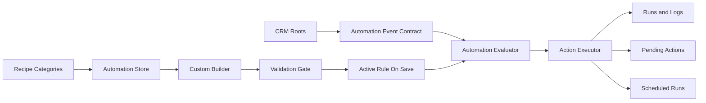

# Automation Store Execution Plan

## Product Decision

Build the structure of an independent Automation Store, not every automation possibility. The V1 product should support a future 50-60 template marketplace, but only ship the category structure, the recipe/rule model, the custom builder, and a tiny dogfood set.

The store is a hybrid:

- Success Recipes: ready-made marketplace cards like Review Request After Payment, Job Reminder SMS, Estimate Follow-Up, and Revenue Recovery.
- Custom Builder: owner-created automations using real-time CRM events, conditions, actions, timing, templates, and tokens.

Owner-created automations become effective immediately after Save, but Save must be blocked unless validation passes. There is no separate enable step for valid rules unless a later UX flow adds draft mode.

Core rule:

```text
Minimum automation catalog now.
Maximum structure for future SaaS.
```



## Non-Negotiables

- Automation Store is its own product body at [frontend/app/automations/page.tsx](../frontend/app/automations/page.tsx), not a settings panel.
- Automation logic must not be scattered inside invoice, job, call, messaging, inventory, or inspection screens.
- CRM roots emit or expose trusted events. Automation Store evaluates those events.
- Every automation is structured as trigger + conditions + action + timing + mode + tokens.
- Every successful, skipped, blocked, pending, failed, or sent attempt must be auditable.
- Phoenix-specific values must live in organization settings, templates, and tokens.
- V1 must not mutate invoice totals, payment ledger state, quote totals, inventory stock, legal/WETT reports, or customer data silently.

## V1 Scope

Build now:

- Independent `/automations` route and main navigation item.
- Marketplace category structure for future 50-60 recipes.
- A small starter catalog, not the full 50-60 catalog.
- Owner-created custom automation flow in V1.
- One-card-per-action/channel template model.
- Backend entities and APIs for templates, rules, runs, logs, settings, pending actions, and scheduled runs.
- Real-time event contract structure.
- Registries in code for triggers, conditions, actions, timing, tokens, risk, and templates.
- Validation gate that makes Save immediately active only when safe.
- Kill switches and audit logs.
- 1-2 Phoenix dogfood recipes created through the same structure.

Do not build now:

- All 50-60 recipe cards.
- Full Zapier-style branching.
- External webhooks.
- Multi-step automation chains.
- Automatic financial/document/inventory mutations.
- SaaS marketplace packaging.
- Email transport unless a provider is selected.

## Marketplace Category Structure

V1 should define the category frame so 50-60 future recipes have a home:

- Featured Automations
- Recommended for Phoenix
- Reminders
- Sales Follow-Up
- Payments & Documents
- Marketing & Reviews
- Phone Actions
- Office Operations
- Technician & Field Ops
- Inventory & Stock
- Warranty & Retention
- Inspections & Reports

Each future card should map to one concrete action/channel. For example, `Review Request by SMS` and `Review Request Internal Task` are separate cards if they behave differently.

## Phase 0: Source of Truth and Contracts

- Treat [docs/phoenix_crm_automation_store_source_of_truth_v2_independent_body.md](phoenix_crm_automation_store_source_of_truth_v2_independent_body.md) as the active contract.
- Keep [docs/phoenix_crm_automation_store_source_of_truth.md](phoenix_crm_automation_store_source_of_truth.md) as earlier reference only.
- Keep these mandatory separations: template, rule, run, log, pending action, scheduled run.
- Do not build automations as hardcoded feature buttons. Every automation must be expressible as registered trigger + user-selected conditions + registered action + approval mode.
- Keep Phoenix dogfood values in organization settings, templates, and tokens, not in engine logic.
- Preserve the no-go rules: no invoice/payment ledger mutation, no unresolved tokens, no unapproved customer sends, no inventory deduction in V1.

Add an Automation Event Contract:

```json
{
  "eventId": "evt_123",
  "organizationId": "default",
  "source": "invoice",
  "event": "invoice.balance_zero",
  "entityType": "invoice",
  "entityId": "inv_123",
  "occurredAt": "2026-05-10T12:00:00Z",
  "payloadVersion": 1,
  "payload": {}
}
```

The first implementation can use service calls or internal dispatch from existing backend flows, but the shape should already look like an event intake model.

## Phase 1: Store Shell

- Add [frontend/app/automations/page.tsx](../frontend/app/automations/page.tsx) as the primary Automation Store route.
- Add focused frontend helpers/components under [frontend/app/automations/](../frontend/app/automations/) or [frontend/components/automations/](../frontend/components/automations/) for the hero, summary cards, category filters, recipe cards, active automations, and builder entry points.
- Add `Automations` to [frontend/components/app-shell.tsx](../frontend/components/app-shell.tsx), visible as a main CRM area, not buried under settings.
- Show the store as an independent command center: available templates, active rules, pending approvals, runs today, failed actions, and kill switch state.
- Show category tabs/cards even before all future recipes exist.
- Include two entry points: `Browse Success Recipes` and `Create Custom Automation`.
- Show risk, status, action/channel, required setup, and owner-facing save behavior.
- No runtime automation should execute in this phase.

Suggested frontend ownership:

- [frontend/app/automations/page.tsx](../frontend/app/automations/page.tsx)
- [frontend/app/automations/store/page.tsx](../frontend/app/automations/store/page.tsx)
- [frontend/app/automations/active/page.tsx](../frontend/app/automations/active/page.tsx)
- [frontend/app/automations/pending-actions/page.tsx](../frontend/app/automations/pending-actions/page.tsx)
- [frontend/app/automations/logs/page.tsx](../frontend/app/automations/logs/page.tsx)
- [frontend/components/automations/automation-store-card.tsx](../frontend/components/automations/automation-store-card.tsx)
- [frontend/components/automations/automation-builder-modal.tsx](../frontend/components/automations/automation-builder-modal.tsx)
- [frontend/components/automations/sentence-builder.tsx](../frontend/components/automations/sentence-builder.tsx)
- [frontend/lib/automations/automation-model.ts](../frontend/lib/automations/automation-model.ts)

## Phase 2: Backend Foundation

- Add an `AutomationsModule` under [backend/src/automations/](../backend/src/automations/) with a controller, service layer, registries, validation, evaluator, executor, scheduler, renderer, and audit service.
- Add generic registries before live automations:
  - Trigger Registry
  - Condition Registry
  - Action Registry
  - Timing Registry
  - Token Registry
  - Template Registry
  - Risk Registry
- Keep registries in code for V1. Add registry tables later only when the product needs dynamic marketplace administration.
- Add TypeORM entities under [backend/src/database/entities/](../backend/src/database/entities/) for:
  - `automation_templates`
  - `automation_rules`
  - `automation_runs`
  - `automation_logs`
  - `automation_pending_actions`
  - `automation_scheduled_runs`
  - `automation_settings`
  - `crm_tasks`
- Consider `automation_events` in V1 if event debugging is needed immediately; otherwise define it in the contract and add the table in V1.5.
- Register the module and entities in [backend/src/app.module.ts](../backend/src/app.module.ts). This is protected/contract-sensitive, so keep the edit narrow.
- Extend [backend/src/auth/permissions.ts](../backend/src/auth/permissions.ts) with automation permissions such as `automations.view`, `automations.manage`, `automations.approve`, and `automations.settings.manage`.
- Extend organization settings in [backend/src/database/entities/organization-setting.entity.ts](../backend/src/database/entities/organization-setting.entity.ts), [backend/src/settings/settings.service.ts](../backend/src/settings/settings.service.ts), and [backend/src/settings/settings.controller.ts](../backend/src/settings/settings.controller.ts) for required automation tokens like timezone, Google review URL, default SMS number, and business hours.

Suggested backend ownership:

- [backend/src/automations/automations.module.ts](../backend/src/automations/automations.module.ts)
- [backend/src/automations/automations.controller.ts](../backend/src/automations/automations.controller.ts)
- [backend/src/automations/automations.service.ts](../backend/src/automations/automations.service.ts)
- [backend/src/automations/automation-registry.ts](../backend/src/automations/automation-registry.ts)
- [backend/src/automations/automation-evaluator.service.ts](../backend/src/automations/automation-evaluator.service.ts)
- [backend/src/automations/automation-executor.service.ts](../backend/src/automations/automation-executor.service.ts)
- [backend/src/automations/automation-scheduler.service.ts](../backend/src/automations/automation-scheduler.service.ts)
- [backend/src/automations/automation-template-renderer.service.ts](../backend/src/automations/automation-template-renderer.service.ts)
- [backend/src/automations/automation-audit.service.ts](../backend/src/automations/automation-audit.service.ts)

## Phase 3: Data Model

Core tables:

- `automation_templates`: marketplace recipe cards and owner-created template definitions.
- `automation_rules`: active company-specific configured automations.
- `automation_runs`: one evaluation/execution attempt.
- `automation_logs`: audit trail attached to rules/runs/events.
- `automation_pending_actions`: human approval queue.
- `automation_scheduled_runs`: delayed and anchor-based work.
- `automation_settings`: kill switches and global automation settings.
- `crm_tasks`: generic internal tasks created manually or by automation.

Important data rules:

- Templates are available products.
- Rules are configured active automations.
- Runs are execution attempts.
- Logs explain what happened.
- Pending actions require human decision.
- Scheduled runs wait for a future time.
- Rules should store structured JSON, not sentence text as truth.
- Runs should keep `rule_version` or a rule snapshot so history remains explainable after edits.

## Phase 4: Registries

Start with a controlled registry subset, but shape it for growth.

Trigger families:

- Jobs: `job.created`, `job.scheduled`, `job.rescheduled`, `job.started`, `job.completed`, `job.cancelled`
- Invoices/Payments: `invoice.created`, `invoice.sent`, `invoice.payment_recorded`, `invoice.balance_zero`, `invoice.unpaid_after_x_days`
- Estimates/Quotes: `estimate.created`, `estimate.sent`, `estimate.approved`, `estimate.not_approved_after_x_days`
- Calls: `call.missed`, `call.voicemail_received`, `call.callback_not_completed_after_x_time`
- Messaging: `sms.received`, `sms.unread_after_x_time`, `sms.failed`
- Inventory: `inventory.low_stock`, `inventory.item_used`, `inventory.reorder_point_reached`
- Inspections/Reports: `inspection.created`, `inspection.completed`, `report.ready`, `report.missing_required_fields`

V1 safe actions:

- `send_sms_from_approved_template`
- `send_review_link_from_approved_template`
- `notify_office`
- `notify_technician`
- `create_crm_task`
- `create_pending_action`

V1 condition operators:

- `equals`
- `not_equals`
- `exists`
- `not_exists`
- `greater_than`
- `less_than`
- `before`
- `after`
- `within_last`
- `not_within_last`

Token groups:

- Company
- Client
- Job
- Invoice
- Estimate/Quote
- Technician
- Office User

## Phase 5: Owner Builder and Save Behavior

- Build rule APIs for listing templates, creating rules, editing rules, deleting/disabling rules if needed, validating structured JSON, and retrieving active rules.
- Add the sentence-based builder UI under [frontend/app/automations/](../frontend/app/automations/) while storing structured JSON only.
- The builder must let the owner decide the trigger and condition, for example:
  - When `invoice` `is fully paid`, do `send review SMS`, only if `job status` `is` `completed`.
  - When `job` `is completed`, do `create task`, only if `inventory usage` `is missing`.
  - When `invoice` `is created`, do `notify office`, with `draft only`.
- Changing a trigger must filter valid conditions, tokens, timing anchors, and actions. Invalid combinations should be impossible in the UI and rejected by the backend.

Save behavior:

```text
Owner builds automation.
Owner presses Save.
Backend validates trigger, conditions, timing, action, template, tokens, role, risk, and kill switch compatibility.
If valid, the rule is active immediately.
If invalid, Save is blocked with clear setup errors.
```

For customer-facing sends, validation must require:

- approved message template
- valid target field
- all required tokens resolvable or safely previewable
- idempotency key strategy
- duplicate-send guard
- kill switch checks
- role permission

## Phase 6: Safety, Approval, and Audit

- Add pending action and log views, either as sections in the main route first or child routes later:
  - [frontend/app/automations/pending-actions/page.tsx](../frontend/app/automations/pending-actions/page.tsx)
  - [frontend/app/automations/logs/page.tsx](../frontend/app/automations/logs/page.tsx)
- Implement backend run/log/pending-action services before customer-facing sends. Every evaluation path must create an auditable run/log record, including skipped and failed attempts.
- Add `crm_tasks` as the generic internal task model instead of reusing telephony callback tasks for non-call workflows.

Required kill switches:

- Pause all automations.
- Disable all customer-facing sends.
- Disable review requests.
- Disable payment reminders.
- Disable scheduled runs.

Idempotency rule:

```text
ruleId + ruleVersion + actionType + targetType + targetId + relatedEntityType + relatedEntityId
```

The exact key can evolve, but every customer-facing action must have a unique duplicate-prevention strategy before auto-send.

## Phase 7: Dogfood First Phoenix Recipes

- Configure `review_request_after_paid_invoice_sms` as a Success Recipe and rule using the same template/rule system, not as a special backend branch.
- Trigger from invoice/payment ledger truth, using [backend/src/crm/invoice-payment-ledger.service.ts](../backend/src/crm/invoice-payment-ledger.service.ts) and the invoice/job relationship in [backend/src/database/entities/invoice.entity.ts](../backend/src/database/entities/invoice.entity.ts) and [backend/src/database/entities/job.entity.ts](../backend/src/database/entities/job.entity.ts).
- Required conditions:
  - invoice balance is zero
  - related job is completed
  - company Google review URL exists
  - approved SMS template exists
  - customer phone exists
  - review request has not already been sent for this rule/entity
  - customer-facing sends are not disabled
- Use existing messaging infrastructure from [backend/src/messaging/](../backend/src/messaging/) and approved SMS templates from [backend/src/messaging/txt/txt-templates.service.ts](../backend/src/messaging/txt/txt-templates.service.ts).
- If owner chooses auto-send, validation must be strict enough to block incomplete setup. If there is uncertainty, the recipe should create a pending action instead of sending.

Second optional dogfood recipe:

- `missed_call_recovery_task`: when a call is missed, create CRM task or office alert.

This avoids overbuilding while proving both customer-facing and internal-action paths.

## Phase 8: Scheduler and Real-Time Event Processing

- Add `automation_scheduled_runs` processing for owner-selected timing: immediately, X minutes/hours/days after trigger, X hours before job scheduled time, X days after estimate sent.
- Support cancellation/recalculation when anchors change, especially job reschedules.
- Respect company timezone from organization settings.
- Keep scheduler execution idempotent, log all outcomes, and block sends when kill switches are active.
- Start with service-level event dispatch from trusted backend flows. Move to a more formal event inbox/table if debugging or reliability requires it.

## Phase 9: Expand Recipe Marketplace Later

- Add safe recipe cards gradually after the independent builder and dogfood paths are stable:
  - Job Reminder SMS
  - Estimate Not Approved Follow-Up
  - Unpaid Invoice Follow-Up
  - Missed Call Recovery
  - Inventory Usage Reminder After Job Completion
- Keep category slots visible, but do not create 50-60 cards until the recipe system is stable.
- Default customer-facing medium-risk automations to manual approval.
- Keep inventory, financial ledger, document, and warranty actions suggestion-only or approval-only.

## Phase 10: Advanced Engine Later

- Defer status updates, webhooks, inventory deduction suggestions, branching, multi-step automations, and SaaS marketplace packaging until V1 is stable.
- Do not start V2 until the foundation, logs, approvals, kill switches, and scheduler have real usage confidence.

## Protected Areas

Treat these as contract-sensitive:

- [backend/src/app.module.ts](../backend/src/app.module.ts)
- [backend/src/auth/permissions.ts](../backend/src/auth/permissions.ts)
- [backend/src/database/entities/](../backend/src/database/entities/)
- [backend/src/crm/](../backend/src/crm/)
- [backend/src/messaging/](../backend/src/messaging/)
- [backend/src/telephony/](../backend/src/telephony/)
- [backend/src/inventory/](../backend/src/inventory/)
- [backend/src/inspections/](../backend/src/inspections/)
- [frontend/components/app-shell.tsx](../frontend/components/app-shell.tsx)
- [frontend/app/invoices/](../frontend/app/invoices/)
- [frontend/app/jobs/](../frontend/app/jobs/)
- [frontend/app/messaging/](../frontend/app/messaging/)
- [frontend/app/calls/](../frontend/app/calls/)

Changes in these files should stay narrow and directly tied to event emission, route wiring, permissions, or transport integration.

## Risks and Controls

- Scattered logic risk: solve with event contract and automations module ownership.
- Duplicate send risk: solve with idempotency and run/action uniqueness.
- Unsafe save risk: solve by blocking Save unless validation passes.
- Messaging risk: solve with approved templates, token preview, and unresolved-token blocking.
- Scheduler risk: solve with anchor recalculation and cancellation logs.
- SaaS-readiness risk: solve with organization settings and tokenized company values.
- Permission risk: solve with explicit automation permissions and owner/admin kill switch controls.
- Audit risk: solve with logs for every event, run, skip, failure, approval, and send.

## Implementation Todo List

### 1. Contract and Scope

- [x] Treat `phoenix_crm_automation_store_source_of_truth_v2_independent_body.md` as the active product contract.
- [x] Keep Automation Store independent from Settings, Jobs, Invoices, Calls, Messaging, Inventory, and Inspections.
- [x] Confirm V1 builds structure for a future 50-60 recipe marketplace without building all recipes now.
- [x] Confirm owner-created automations save as active only after backend validation passes.
- [x] Confirm V1 no-go rules: no financial mutation, no inventory deduction, no unresolved-token sends, no silent customer messages.

### 2. Frontend Store Shell

- [x] Create `/automations` as the main Automation Store route.
- [x] Add Automation Store to the global app navigation.
- [x] Build the main hero, summary cards, category filters, recipe grid, active automations area, pending actions preview, and logs preview.
- [x] Add marketplace categories: Featured, Recommended, Reminders, Sales Follow-Up, Payments & Documents, Marketing & Reviews, Phone Actions, Office Operations, Technician & Field Ops, Inventory & Stock, Warranty & Retention, Inspections & Reports.
- [x] Add two primary CTAs: `Browse Success Recipes` and `Create Custom Automation`.
- [x] Show card metadata: title, category, business value, risk, action/channel, status, and required setup.

### 3. Backend Foundation

- [x] Add `backend/src/automations/` module, controller, service, registry, evaluator, executor, scheduler, renderer, and audit service files.
- [x] Register the automations module in `backend/src/app.module.ts`.
- [x] Add automation permissions in `backend/src/auth/permissions.ts`.
- [x] Extend organization settings for timezone, Google review URL, default SMS number, business hours, and automation-safe company tokens.
- [x] Define the Automation Event Contract shape for CRM roots to emit trusted events.
- [x] Decide whether `automation_events` is a V1 table or a V1.5 debugging table.

### 4. Data Model

- [x] Add `automation_templates`.
- [x] Add `automation_rules`.
- [x] Add `automation_runs`.
- [x] Add `automation_logs`.
- [x] Add `automation_pending_actions`.
- [x] Add `automation_scheduled_runs`.
- [x] Add `automation_settings`.
- [x] Add `crm_tasks` for generic automation-created work.
- [x] Store structured JSON for triggers, conditions, actions, timing, approvals, and token requirements.
- [x] Store rule version or rule snapshot on runs so history remains explainable after rule edits.

### 5. Registries

- [x] Create Trigger Registry with initial job, invoice/payment, estimate, call, messaging, inventory, and inspection/report trigger families.
- [x] Create Condition Registry with allowed fields per trigger/entity.
- [x] Create Action Registry with V1 safe actions only.
- [x] Create Timing Registry for immediate, delayed, and anchor-based timing.
- [x] Create Token Registry for company, client, job, invoice, estimate, technician, and office user tokens.
- [x] Create Risk Registry for low, medium, and high-risk behavior.
- [x] Ensure registry choices filter the builder so invalid combinations are not shown.

### 6. Owner Builder

- [x] Build the sentence builder UI.
- [x] Build the structured rule editor state behind the sentence UI.
- [x] Add Create Custom Automation flow.
- [x] Add Success Recipe configure flow.
- [x] Support one-card-per-action/channel templates.
- [x] Save valid owner-created automations as active immediately.
- [x] Block Save with clear setup errors for invalid trigger/action/condition/token/template combinations.
- [x] Add rule list, edit rule, disable/delete rule, and view activity flows.

### 7. Safety and Audit

- [x] Add validation gate before every Save.
- [x] Add run records for every execution attempt.
- [x] Add logs for success, skipped, blocked, failed, pending, dismissed, approved, and sent states.
- [x] Add kill switches: pause all, disable customer sends, disable review requests, disable payment reminders, disable scheduled runs.
- [x] Add idempotency keys for customer-facing actions.
- [x] Add pending action support for approval-required actions.
- [x] Ensure customer-facing actions require approved templates and rendered token preview.
- [x] Block unresolved tokens from being sent to customers.

### 8. Event Intake and Scheduler

- [x] Wire first trusted CRM root events through the Automation Event Contract.
- [x] Start with service-level event dispatch from backend flows.
- [x] Add scheduled run creation for delayed or anchor-based automations.
- [x] Add scheduled run cancellation/recalculation for changed anchors like job reschedules.
- [x] Respect organization timezone.
- [x] Log scheduled run execution, skip, failure, and cancellation outcomes.

### 9. Dogfood Recipes

- [x] Add `review_request_after_paid_invoice_sms` as a Success Recipe using the normal template/rule system.
- [x] Validate invoice balance from payment ledger truth.
- [x] Require completed related job, customer phone, Google review URL, approved SMS template, no duplicate send, and customer-send kill switch off.
- [x] Use existing messaging infrastructure for SMS sends.
- [x] Add optional `missed_call_recovery_task` as an internal task recipe.
- [x] Confirm neither recipe contains hardcoded Phoenix business values inside the automation engine.

### 10. Verification and Release

- [x] Check `git status --short` after each package.
- [x] Run backend build.
- [x] Run frontend changed-file lint and frontend build.
- [x] Confirm `/automations` route compiles and is included in the Next build.
- [x] Confirm role access is wired through server-side allowed roles and backend automation permissions.
- [x] Confirm custom automation creation has a frontend builder and backend create-rule endpoint.
- [x] Confirm invalid builder combinations are blocked by backend registry validation.
- [x] Confirm save-as-active validation is wired through the rule save endpoint.
- [x] Confirm logs, pending actions, kill switches, tokens, and duplicate-prevention structures exist.
- [x] Confirm scheduler creation, cancellation/recalculation, and logging structures exist.

## Verification Plan

- After each package, check `git status --short` and confirm no unrelated files changed.
- Run backend build: `npm run build --workspace backend`.
- Run frontend lint/build: `npm run lint --workspace frontend` and `npm run build --workspace frontend`.
- Smoke test `/automations`, navigation, role access, category filters, recipe cards, custom builder, save-as-active validation, pending action creation, approval/dismissal, log creation, kill switches, token rendering, unresolved-token blocking, and duplicate send prevention.
- Test owner-created automation from scratch.
- Test invalid combinations are blocked in UI and backend.
- Test customer-facing automation cannot save without approved template and required tokens.
- For scheduler packages, test scheduled creation, execution, cancellation/recalculation, failed-run logging, and idempotency.
