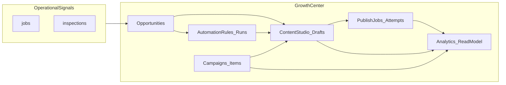

# WizField Docs Lean Cutover — Execution Report

> **HISTORICAL REVIEW SNAPSHOT — not current authority.**  
> Concatenated copies below are frozen. Current canonical docs: [`docs/WizField_Master_Source_of_Truth.md`](../WizField_Master_Source_of_Truth.md) and [production closeout](../audit/production-2026-09/WIZFIELD_PRODUCTION_CLOSEOUT.md).

**Purpose:** Final report for ChatGPT / external review of the post-cutover documentation package.

**Review package contents:** 11 active canonical docs (see file list below). **Excluded by design:** `AI_WORKFLOW_RULES.md`, `OWNER_FEATURE_CHECKLIST_EN.md`, `Execute.txt`.

---

## Commit

| Field | Value |
|---|---|
| Hash | `92267971c8f463461f78ba52175dc9139446d429` |
| Message | `docs: lean source-of-truth cutover` |
| Branch | `SaaS-master` |

---

## git status --short (post-commit)

```
?? .cursor/
```

All cutover changes are committed. Only `.cursor/` remains untracked.

---

## git diff --stat (cutover commit)

```
 ...nixOS_WizField_Signup_Activation_Master_Plan.md |  656 ------------
 .../WizField_AI_Brain_V1_Home_Intelligence_SPEC.md |    6 +-
 ...eld_AI_Engineering_Closeout_and_Gap_Register.md |    2 +-
 docs/WizField_AI_Master_Source_of_Truth.md         |    2 +-
 docs/WizField_AI_Sales_Enablement_Risk_Register.md |    2 +-
 docs/WizField_Disaster_Recovery_and_Rebuild_Runbook.md |  374 +++++++
 ...zField_Engineering_Closeout_and_Verification.md |    2 +-
 ...ield_Growth_Center_Closeout_and_Verification.md |  109 --
 ...WizField_Growth_Center_Marketing_Master_Plan.md | 1055 --------------------
 docs/WizField_Growth_Center_Source_of_Truth.md     |   95 +-
 docs/WizField_Language_Store_Execution_Packages.md |   23 -
 docs/WizField_Language_Store_Master_Plan_Prompt.md |   22 -
 docs/WizField_Language_Store_Source_of_Truth.md    |    4 +-
 docs/WizField_Master_Source_of_Truth.md            |   28 +-
 docs/WizField_Reverification_Runbook.md            |    4 +-
 .../WizField_V1_Field_Partner_Feedback_Form.md     |    0
 .../WizField_V1_Field_Partner_Feedback_Tracker.csv |    0
 ...WizField_V1_Field_Partner_Onboarding_Message.md |    0
 18 files changed, 500 insertions(+), 1884 deletions(-)
```

---

## Deleted files

| Path | Reason |
|---|---|
| `docs/PhoenixOS_WizField_Signup_Activation_Master_Plan.md` | Absorbed into Master SoT §17; git history retains full plan |
| `docs/WizField_Growth_Center_Marketing_Master_Plan.md` | Strategy thesis extracted to GC SoT §1; git history retains |
| `docs/WizField_Growth_Center_Closeout_and_Verification.md` | Merged into GC SoT §14; git history retains |
| `docs/WizField_Language_Store_Execution_Packages.md` | Tombstone stub; git history retains |
| `docs/WizField_Language_Store_Master_Plan_Prompt.md` | Tombstone stub; git history retains |
| `docs/_next-sot/` (entire folder) | Staging folder removed after verified root replacement |

---

## Moved pilot files (active ops — not deleted)

| From | To |
|---|---|
| `docs/WizField_V1_Field_Partner_Onboarding_Message.md` | `docs/ops/pilot/WizField_V1_Field_Partner_Onboarding_Message.md` |
| `docs/WizField_V1_Field_Partner_Feedback_Form.md` | `docs/ops/pilot/WizField_V1_Field_Partner_Feedback_Form.md` |
| `docs/WizField_V1_Field_Partner_Feedback_Tracker.csv` | `docs/ops/pilot/WizField_V1_Field_Partner_Feedback_Tracker.csv` |

Git recorded these as renames (R100).

---

## Safety confirmations

| Check | Status |
|---|---|
| `.cursor/` staged or committed | **NO** — remains untracked (`?? .cursor/`) |
| `backend/**` modified | **NO** |
| `frontend/**` modified | **NO** |
| Migrations modified | **NO** |
| Package files modified | **NO** |
| Config files modified | **NO** |
| `docs/archive/ai/**` touched | **NO** |
| `docs/gate-12-fixture-bootstrap.sql` touched | **NO** |
| Gate 11–14 statuses changed | **NO** — unchanged: Gate 11–12 `CLOSED / GO`; Gate 13 `ENGINEERING PASS`; Gate 14 `ENGINEERING COMPLETE` |
| Field/mobile app implementation claimed | **NO** |

---

## Post-cutover integrity checks (passed at commit time)

- `git grep "../../backend" -- docs/*.md` → no matches
- Stale references to deleted planning/closeout/stub files → no matches
- Gate status grep → unchanged across active docs

---

## Key content changes in review package

| Document | Notable update |
|---|---|
| `WizField_Master_Source_of_Truth.md` | New §17 signup/activation product contract; §16 DR runbook companion; removed Phoenix/GC planning pointers |
| `WizField_Growth_Center_Source_of_Truth.md` | Strategic thesis in §1; §14 program closure evidence; removed marketing plan / standalone closeout references |
| `WizField_Disaster_Recovery_and_Rebuild_Runbook.md` | **New** operational companion (not product SoT) |
| Other SoT files | Link normalization (`../backend`, `../frontend`); minor archive pointer fixes |

---

## Review package file list (11 files)

1. `WizField_Master_Source_of_Truth.md`
2. `WizField_Engineering_Closeout_and_Verification.md`
3. `WizField_Reverification_Runbook.md`
4. `WizField_Owner_Launch_Activation_Checklist.md`
5. `WizField_AI_Master_Source_of_Truth.md`
6. `WizField_AI_Engineering_Closeout_and_Gap_Register.md`
7. `WizField_AI_Sales_Enablement_Risk_Register.md`
8. `WizField_AI_Brain_V1_Home_Intelligence_SPEC.md`
9. `WizField_Growth_Center_Source_of_Truth.md`
10. `WizField_Language_Store_Source_of_Truth.md`
11. `WizField_Disaster_Recovery_and_Rebuild_Runbook.md`

**Single-file upload option:** `WizField_ChatGPT_Review_Bundle.md` (this report + all 11 docs concatenated).

**Not in repo root active set but preserved:** `docs/archive/ai/**` (10 AI phase audit files), `docs/ops/pilot/**` (3 field partner files), `docs/gate-12-fixture-bootstrap.sql`.


---

# FILE: docs/WizField_Master_Source_of_Truth.md

# WizField Master Source of Truth

## Purpose

This is the single canonical product and architecture truth for the WizField project.

It replaces the older scattered Gate 0-14 roadmap, SaaS foundation, numbered Gate 1-10 source-of-truth docs, the Gate 11 UX contract, and the standalone Gate 13 billing sync document as the first document to read before any future WizField discussion.

## 1. Product identity and project separation

- The repository is the WizField workstream: a multi-tenant SaaS conversion of the proven Phoenix CRM operating engine.
- `Phoenix_CRM` and `WizField` are separate workstreams and must remain mentally and operationally separate.
- Historical boundary preserved: `Phoenix_CRM is protected. WizField is the surgery room.`
- The product direction is `WizField`: a field-service operating system for owners running one or more service businesses from one account.

## 2. Phoenix_CRM vs WizField safety boundary

- Do not treat `WizField` as a place for casual production fixes, broad cleanup, or mixed-scope refactors.
- Do not treat `Phoenix_CRM` as a safe place to experiment with SaaS tenant architecture.
- The active SaaS truth lives in this document plus the three companion canonical docs, not in historical planning fragments.
- Git history preserves historical detail; the active docs tree should stay small and current.

## 3. TypeORM-first execution decision

- TypeORM is the active ORM and execution path.
- Prisma is frozen / reference-only during the SaaS conversion.
- Do not use Prisma for active reads, writes, migrations, or dual-runtime planning.
- Tenant ownership, migrations, services, controllers, and query filters are defined through the active TypeORM/NestJS stack.
- The objective is to make the existing engine tenant-safe first, not to change ORM and architecture at the same time.

## 4. Product north star

WizField is not a generic CRM reskin. It is a multi-tenant field-service operating system built from the Phoenix CRM operational engine.

Core promise:

> WizField helps field-service owners manage calls, leads, jobs, estimates, invoices, communication, reports, and customer access across multiple businesses from one operating system.

The product remains anchored in real field-service operations: customer history, lead intake, job management, estimates, invoices, payments, calls, SMS, inspections, reports, warranty documents, dispatch, and scheduling.

## 5. Multi-tenant architecture model

- Platform and tenant concerns are separate.
- Organizations are the top-level tenant boundary for business data.
- Users are global identities.
- Memberships link users to organizations.
- Roles and permissions belong to memberships, not globally to users.
- Every tenant-owned request resolves actor, active organization, membership, role, and permissions.
- Platform-owned concepts remain distinct from organization-owned records, public-access resources, immutable snapshots, and provider/integration records.

Conceptual model:

```text
Platform
-> Users
-> Organizations
-> Memberships
-> Membership-scoped roles and permissions
-> Organization-owned business records
-> Public access resources bound back to organization-owned records
```

## 6. Multi-org UX model

- One user may access multiple businesses / workspaces.
- Users switch organizations by explicit click through the supported switcher flow.
- The active organization comes from the authenticated session, not from an arbitrary frontend org id.
- Successful switching performs a full navigation to `/home` so stale client state is cleared.
- Full UX and data context change with the active organization: dashboard, customers, leads, jobs, estimates, invoices, settings, search, calls, messaging, reports, booking, and portal-adjacent context.
- Single-membership users get a simple current-workspace display, not a fake switcher.
- Multi-business capability is a core product differentiator, not an edge feature.

## 7. Billing model

- Billing authority is shared-billing-account based, not workspace-by-workspace only.
- `billing_accounts` is the authoritative payer / subscription layer.
- `organization_billing` is coverage / linkage and entitlement projection, not the subscription authority.
- A single billing account may cover multiple organizations under one entitlement.
- Current plan structure:
  - Starter = 1 business
  - Pro = up to 3 businesses
  - Business = expanded local model with no fixed hard cap currently enforced in local repo truth
- Plan enforcement resolves from organization context through the linked shared billing account.
- Billing is SaaS/platform billing and remains separate from tenant CRM invoice/payment records.

## 8. Stripe-first provider model

- Billing uses a provider abstraction boundary.
- Stripe is the active provider implementation.
- Stripe is webhook-authoritative for subscription state synchronization.
- Checkout does not activate billing from the success redirect page.
- Verified Stripe webhook events reconcile local billing state.
- Clover is parked as historical traceability only and is not the active Gate 13 path.
- Clover code, provider references, and schema lineage may remain in repo history for traceability, but Stripe remains the active billing-provider truth unless a future owner-approved provider reactivation explicitly changes that.

## 9. Tenant isolation rules

- Never fetch tenant-owned data by `id` only.
- Tenant-owned reads, updates, deletes, counts, and lists must remain organization-scoped.
- Cross-organization access is forbidden.
- Backend membership validation is authoritative on every request.
- Frontend state is not trusted for authorization by itself.
- Search, dashboard, aggregates, automations, and communication flows must remain scoped to the active organization unless an explicit audited platform-admin surface exists.
- Cross-tenant leakage is the primary product risk and remains unacceptable.

## 10. Public access rules: portal, booking, and token ownership

- Public booking must resolve the target organization first.
- Public portal and access-token flows must bind back to organization-owned resources.
- Token resolution must prove validity, expiry status, target resource ownership, and correct organization scope.
- Public routes must not expose internal records by bare UUID alone.
- Invalid, expired, or reused tokens must fail safely.
- Public booking must never silently default to the wrong tenant.

## 11. Communications ownership rules: calls, SMS, and owned numbers

- Phone numbers are organization-owned.
- `OwnedPhoneNumber` is the routing boundary for telephony and messaging ownership.
- Inbound webhook processing resolves the organization from the receiving number before creating or attaching records.
- Outbound sending verifies that the sending number belongs to the active organization.
- Calls, SMS threads, messages, callback tasks, and related communication records remain organization-scoped.
- There is no tenant-crossing global communications inbox for regular tenant users.

## 12. Document, branding, and snapshot rules

- Platform brand and tenant brand are separate.
- Do not globally rename `Phoenix_CRM` or historical CRM/business data.
- Tenant-facing business identity comes from organization-owned settings.
- Generated invoices, estimates, reports, warranties, and similar artifacts must use immutable snapshots where historical truth matters.
- A later settings change must not silently rewrite a previously generated tenant document.

## 13. Gate 0-14 final status table

| Gate | Title | Final status |
|---|---|---|
| 0 | Repo Safety + Build Baseline | Completed / absorbed into current repo truth |
| 1 | SaaS Source of Truth Lock | Completed / absorbed into current repo truth |
| 2 | TypeORM Direction Lock | Completed / absorbed into current repo truth |
| 3 | Auth, ActorContext, Membership, activeOrgId | Completed / absorbed into current repo truth |
| 4 | Organization Entity Ownership in TypeORM | Completed / absorbed into current repo truth |
| 5 | Core Query Isolation | Completed / absorbed into current repo truth |
| 6 | Search + Dashboard Isolation | Completed / absorbed into current repo truth |
| 7 | Self-Serve + Portal/Public Access Isolation | Completed / absorbed into current repo truth |
| 8 | Calls/SMS/Webhook Organization Routing | Completed / absorbed into current repo truth |
| 9 | Settings + Branding + Document Snapshots | Completed / absorbed into current repo truth |
| 10 | Full Engine SaaS Conversion | Completed / absorbed into current repo truth |
| 11 | Multi-Business User Experience | CLOSED / GO |
| 12 | Beta Readiness + Security Audit | CLOSED / GO |
| 13 | Billing + Plan Enforcement | ENGINEERING PASS |
| 14 | Launch Preparation | ENGINEERING COMPLETE |

## 14. Current owner launch activation boundary

Internal engineering for the Gate 0-14 foundation phase is complete enough that no Gate 11-14 status should be reopened by this rename pass.

What remains is owner-managed launch activation, not unfinished foundation engineering:

- live Stripe activation and webhook confirmation
- final Terms
- final Privacy
- production support email and escalation handling
- owner-selected analytics / error-monitoring setup
- production-like deployed rerun evidence where required
- final program/public launch decision

Paid acquisition remains outside engineering closeout and stays gated on owner launch activation completion.

## 15. Pre-AI and Post-AI program posture

The Pre-AI Product Foundation, Pre-AI UX / FE correction package, and Portal V1 lifecycle + hardening pass were closed before the AI workstream began.

The closed Pre-AI correction baseline includes:

- role-aware navigation / role-sensitive shell affordances
- CRM Automations vs Growth Center Automations clarity
- Schedule / Dispatch IA visibility
- Office Home snapshot improvements
- Pricing / Billing Success credibility cleanup
- Portal staff magic-link generation lifecycle
- Portal org/resource read hardening
- Portal redeem transaction hardening
- Customer profile Generate + Copy portal link UX

The standalone `WizField_Pre_AI_Final_Correction_Summary.md` is not present in the current checkout. Its closure truth is preserved here and in the engineering closeout record rather than recreated as a new active standalone document.

Owner review accepted the Post-AI full-program audit verdict as:

```text
B - WIZFIELD POST-AI PROGRAM CLEAN WITH NON-BLOCKING GAPS
```

This means:

- no P0 or P1 blockers were accepted after AI Phase 0-4 closure
- the AI Program did not introduce a serious cross-product architecture risk
- the bounded Post-AI Correction Pass is cleanup and alignment work, not a reopening of Gate 11-14, Growth Center V1, Language Store V1, Portal V1, or AI Phase 0-4

Language Store remains a Settings / add-on-oriented surface for now. It must not be added to primary shell navigation unless a future owner IA decision changes that.

## 16. Current next-phase handoff

The next phase is not "redo SaaS architecture." The next phase is controlled launch activation on top of the completed engineering foundation.

Use the companion docs this way:

- `WizField_Engineering_Closeout_and_Verification.md` for final engineering evidence and locked closeout truth
- `WizField_AI_Master_Source_of_Truth.md` for shipped AI program truth (Phases 0–4)
- `WizField_AI_Engineering_Closeout_and_Gap_Register.md` for AI verification evidence and gap closure
- `WizField_Growth_Center_Source_of_Truth.md` for active Growth Center V1 implementation truth
- `WizField_Language_Store_Source_of_Truth.md` for active Language Store product and architecture truth
- `WizField_Owner_Launch_Activation_Checklist.md` for owner-managed launch activation items
- `WizField_Reverification_Runbook.md` for future production-like reruns and operator replay (see §6B for AI)
- `WizField_Disaster_Recovery_and_Rebuild_Runbook.md` for operational disaster recovery and environment rebuild guidance (not product truth)

Signup and activation product contract: see §17 below (engineering closeout and owner launch checklist cover evidence and owner activation scope).

Short handoff summary:

1. Keep the Gate 11-14 engineering statuses unchanged.
2. Treat live Stripe, legal/support closeout, monitoring, and launch-program approval as owner activation scope.
3. Use the reverification runbook for any future production-like replay.
4. Keep the active documentation system small and canonical; rely on git history for retired detail.

## 17. Self-serve signup and activation product contract

Locked product rules (do not reopen Gate 11-14 architecture):

- Auth at signup: email + password only; no social login in V1 launch scope.
- Signup form fields: Full Name, Email, Password, Business Name only — no phone, address, industry, or team-size fields at first launch.
- Flow order: signup → first workspace created → mandatory plan selection → Stripe Checkout → webhook-authoritative activation → full CRM access.
- Rejected model: checkout-before-signup (payer/workspace/billing anchor must exist before Checkout).
- Post-signup UX: user lands on subscription activation, not live CRM; message frame is “workspace is ready — activate to enter.”
- Hard gate: registered-but-unpaid users must not reach operational CRM routes; unpaid return paths route to activation/subscribe, not `/home`.
- Activation authority: Stripe webhook sync only; `/billing/success` may show processing state but must not claim active subscription from redirect alone.
- Pre-activation internal truth: user, first organization, owner membership, session active org, shared billing_account, org–billing coverage, subscription not yet active.
- Access states:

| State | CRM access | Activation screen |
|---|---|---|
| registered_unpaid | No | Yes |
| checkout_pending | No | Yes |
| active_trialing / active_paid | Yes | No |

- Add-business: entitlement resolved from shared billing account before org creation; Starter=1, Pro=3, Business=expanded local model; block + upgrade path when over limit.


---

# FILE: docs/WizField_Engineering_Closeout_and_Verification.md

# WizField Engineering Closeout and Verification

## Purpose

This is the single consolidated engineering closeout record for the completed WizField foundation and Gate 11-14 phase.

It preserves the final successful engineering evidence, removes duplicated superseded bodies, and keeps historical reversals only as short notes.

## 1. Final statuses

- Gate 11: `CLOSED / GO`
- Gate 12: `CLOSED / GO`
- Gate 13: `ENGINEERING PASS`
- Gate 14: `ENGINEERING COMPLETE`

These statuses are locked for this rename pass and are not reopened here.

## 2. Gate 11 verification summary

- Multi-org password login passed for User1 with Org A + Org B memberships.
- Single-org password login passed for User2 with Org C only.
- Active-organization switching passed through `POST /api/auth/active-organization`.
- Forbidden switch to a non-member org failed safely with `organization_access_forbidden`.
- The post-switch navigation target remained `/home`.
- Deep-link stale-data safety was confirmed through foreign-org customer, lead, job, estimate, and invoice negative reads.

## 3. Gate 12 final verification summary

- Gate 12 closed `GO` for the current dev/test engineering phase on the 2026-05-14 rerun.
- Multi-org auth, active organization handling, and session persistence passed.
- Gate 11 regression expectations still held after the Gate 12 rerun.
- Core cross-tenant negatives failed safely.
- Search remained organization-scoped.
- Dashboard data changed correctly with active-organization changes.
- Portal token redemption and session flows passed for valid tokens; expired or reused tokens failed safely.
- Public booking resolved the organization correctly and rejected invalid or inactive slugs safely.
- Self-serve onboarding truth was revalidated directly in current repo truth: signup, first-workspace creation, and authenticated add-business now exist and passed local rerun checks.

## 4. Gate 12 cross-tenant evidence summary

Required topology used for the successful rerun:

- User1 -> Org A + Org B
- User2 -> Org C

Preserved final evidence:

- Auth and active organization: pass
- Gate 11 org switcher regression path: pass
- Core isolation and foreign-ID negatives: pass
- Search and dashboard isolation: pass
- Portal and public links: pass
- Public booking: pass
- Telephony / messaging isolation smoke: pass
- Settings, branding, and document isolation: pass
- Self-serve onboarding truth: pass

Historical note only:

- A 2026-05-13 Path B waiver existed for the earlier dev/test closure attempt.
- That waiver is no longer the active explanation for current repo truth because the 2026-05-14 rerun directly validated signup and add-business flows.

## 5. Gate 13 non-live engineering verification summary

- Backend and frontend builds passed.
- Local migration run passed for the shared billing-account and provider-field migrations.
- Schema verification passed.
- `billing_accounts` is the authoritative payer / subscription layer.
- `organization_billing` remains coverage / linkage only.
- Stripe is the active provider implementation behind a provider abstraction boundary.
- Clover remains parked historical provider trace only; Stripe is the active billing-provider truth.
- Owner-authenticated checkout exists and, without live Stripe secrets configured, fails safely with `billing_provider_not_configured`.
- The Stripe webhook endpoint exists and invalid signatures fail safely.
- Shared billing entitlement behavior passed locally: starter blocked a second business; after safe local plan expansion, a second organization could be added under the same `billing_account_id`.
- Live Stripe checkout execution and live webhook delivery were intentionally not part of the completed engineering evidence and remain owner activation scope.

## 6. Gate 14 route, build, and launch-surface verification summary

- Gate 12 dependency is now satisfied in current engineering truth.
- Gate 13 engineering pass is recorded.
- Launch-surface route checks passed locally for:
  - `/landing`
  - `/pricing`
  - `/signup`
  - `/billing/success`
  - `/terms`
  - `/privacy`
  - `/contact`
  - `/login`
- Pricing and settings copy align with the Stripe-first shared billing model.
- The success page explicitly does not claim activation from redirect alone.
- Backend build, frontend build, and schema verification passed for the final engineering closeout.
- Program/public launch `GO` remains outside the engineering-complete verdict and is deferred to owner launch activation.

## 7. Final command evidence table

| Evidence | Result |
|---|---|
| `npm.cmd run migration:run --workspace backend` | PASS |
| `npm.cmd run schema:verify --workspace backend` | PASS |
| `npm.cmd run inspections:isolation:smoke --workspace backend` | PASS |
| `npm.cmd run document-snapshot:isolation:smoke --workspace backend` | PASS |
| `npm.cmd run telephony-messaging:isolation:smoke --workspace backend` | PASS |
| `npm.cmd run public-booking:isolation:smoke --workspace backend` | PASS |
| `npm.cmd run build --workspace backend` | PASS |
| `npm.cmd run build --workspace frontend` | PASS |
| Backend runtime checks against auth, search, dashboard, settings, portal, and public booking surfaces | PASS |
| Frontend route checks against marketing, legal, auth, and billing-success launch surfaces | PASS |

## 8. Mandatory production-like Gate 12 rerun note

The successful Gate 12 dev/test closeout does not remove the requirement for a focused production-like rerun once WizField is attached to the real public domain and deployed backend.

That future rerun is not a restart of SaaS architecture work. It is a mandatory runtime confidence replay that must re-check at minimum:

1. Public booking on the real domain
2. Portal / magic-link on the real domain
3. Auth / session behavior on the deployed backend
4. Org switching with the 3-org topology or equivalent controlled accounts
5. Direct cross-tenant negatives
6. Relevant smokes, builds, and deployment evidence

Use the canonical reverification runbook for that replay.

## 9. Language Store V1 addendum

This addendum records the bounded P1-P6 Language Store verification pass only. It does not reopen the underlying Gate 11-14 foundation statuses above.

### Language Store V1 verification summary

- P7 remains verification and closeout only.
- No new Language Store product behavior, schema expansion, billing redesign, or UI expansion is part of this addendum.
- Final evidence for Language Store V1 is captured from migration/schema checks, the four Language Store smoke commands, and backend/frontend builds.
- Exact replay commands and future rerun procedure live in `WizField_Reverification_Runbook.md`.

### Language Store V1 evidence summary

- migration run: pass
- schema verify: pass
- entitlement reprojection smoke: pass
- translation engine smoke: pass
- preference isolation smoke: pass
- snapshot safety smoke: pass
- backend build: pass
- frontend build: pass

### Language Store V1 deferred-scope note

This closeout does not add:

- new customer-visible Language Store behavior
- additional billing-provider capability
- new output languages beyond the locked V1 scope
- post-P6 expansion work outside verification evidence

### Language Store V1 closeout statement

- final Language Store V1 verdict: `CLOSED / GO`
- defects found during P7: `none in Language Store product behavior; two narrow verification-harness fixes were completed during closeout`
- current product truth assumes the unified authenticated app shell and `/home`, not a separate Language Store technician surface

## 10. Historical note only

- A 2026-05-13 Gate 12 `NO-GO` existed.
- It was superseded by the successful 2026-05-14 rerun.
- The prior blocker was the broken multi-org password login path.
- The older full `NO-GO`, `WAIVED`, and `HOLD` bodies are intentionally not repeated here.

## 11. Migration hygiene note for `1778630000000-organization-billing.ts`

- `1778630000000-organization-billing.ts` remained untouched during the final Gate 13 closeout.
- The current migration chain treats it as historical schema lineage.
- The shared billing-account migration and billing-provider-field migration applied after it successfully.
- Any future edit to `1778630000000-organization-billing.ts` requires a separate owner decision and is outside this closeout record.

## 12. AI Program Phases 0–4 addendum

This addendum records the bounded AI program closeout and gap-closure pass only. It does not reopen Gate 11–14 statuses.

- Product and flag truth: [`WizField_AI_Master_Source_of_Truth.md`](WizField_AI_Master_Source_of_Truth.md)
- Evidence, verification matrices, and gap register: [`WizField_AI_Engineering_Closeout_and_Gap_Register.md`](WizField_AI_Engineering_Closeout_and_Gap_Register.md)
- Production replay: [`WizField_Reverification_Runbook.md`](WizField_Reverification_Runbook.md) §6B

| Evidence | Result |
|----------|--------|
| `telephony-messaging:isolation:smoke` (9a–9d) | PASS |
| `operator-copilot:isolation:smoke` | PASS |
| `operator-copilot:contract-check` | PASS |
| Backend / frontend build | PASS |

## 13. Post-AI full-program audit and bounded correction pass

Owner review accepted the Post-AI full-program audit verdict as:

```text
B - WIZFIELD POST-AI PROGRAM CLEAN WITH NON-BLOCKING GAPS
```

This accepted posture records:

- no P0 or P1 blockers were found
- the Pre-AI correction package remained closed after the AI workstream
- AI Phase 0-4 did not introduce a serious cross-product architecture risk
- the follow-up Post-AI Correction Pass is bounded cleanup and alignment work only

The missing standalone `WizField_Pre_AI_Final_Correction_Summary.md` is an evidence caveat resolved by preserving the closed Pre-AI correction truth in the canonical documentation set, not by creating another active standalone closeout file.

The bounded correction pass closes:

- role/navigation affordance alignment for `/calls` against current `calls.view` permission truth
- active documentation topology cleanup for signup and Growth Center planning artifacts
- Clover clarification as parked historical provider trace while Stripe remains active billing truth
- Language Store IA clarification as a Settings / add-on-oriented surface for now, not primary shell navigation

This pass does not reopen Gate 11-14, Growth Center V1, Language Store V1, Portal V1, or AI Phase 0-4.

## Closeout statement

WizField completed the internal engineering foundation through Gate 14 with:

- tenant-safe multi-org UX confirmed
- Gate 12 dev/test rerun closed successfully
- Stripe-first shared billing engineering complete but live activation intentionally parked
- launch-surface engineering complete with final program/public launch still deferred to owner activation

This document is the canonical engineering closeout reference for the completed foundation phase.


---

# FILE: docs/WizField_Reverification_Runbook.md

# WizField Reverification Runbook

## Purpose

This is the reusable operator runbook for future WizField reverification on production-like or deployed environments.

It is a replay tool, not an active engineering gate blocker.

## 1. When to use this runbook

Use this runbook when:

- replaying the required production-like Gate 12 confidence pass
- validating a deployed environment before external beta or broader launch
- rechecking tenant safety after major auth, tenancy, booking, portal, billing-surface, or org-switch changes
- re-establishing confidence after environment recovery or migration activity

Do not use this document to reopen internal Gate 11-14 closeout statuses. Use it to capture fresh runtime evidence on a new environment.

## 2. Required environment

- WizField backend and frontend reachable in the target environment
- Migrated application database
- Ability to run backend and frontend builds
- Ability to run `migration:run`, `schema:verify`, and the four isolation smoke commands
- Access to controlled test accounts and organization fixtures
- If using the smoke harness, a MySQL principal capable of creating and dropping the ephemeral verification databases used by the smoke scripts

## 3. Required test topology

Use this minimum topology:

| Actor | Organizations |
|---|---|
| User1 | Org A + Org B |
| User2 | Org C |

Expectation:

- User1 can sign in normally and switch between Org A and Org B
- User2 signs in normally and sees Org C only
- User1 cannot access Org C
- User2 cannot access Org A or Org B

## 4. Optional fixture and setup guidance

- Controlled mock or seeded fixture data is acceptable for reruns unless the goal is live-customer validation.
- Record stable IDs and slugs for:
  - Org A / Org B / Org C
  - customer, lead, job, estimate, and invoice fixtures
  - search markers per organization
  - valid and invalid portal tokens
  - active and inactive public booking slugs
- If a fixture bootstrap script is used, verify that it matches current schema truth before execution.
- Historical Path B exists only as audit history and is not active rerun scope; current repo truth includes signup and add-business flows.

## 5. MySQL smoke credential requirement and recovery note

The isolation smoke scripts create temporary verification databases. The MySQL principal used for smoke execution must be able to:

- create databases
- drop temporary verification databases
- run migrations inside those verification databases

Recommended approach:

- use a dedicated local smoke user rather than broadening the normal app credential

If smoke execution fails during database creation:

1. Stop and capture the exact MySQL error.
2. Verify the credential used for the smoke commands.
3. Re-run only after DB privilege or credential recovery is complete.

## 6. Exact smoke, build, migration, and schema commands

From the repo root, with the correct environment configured:

```text
npm.cmd run migration:run --workspace backend
npm.cmd run schema:verify --workspace backend
npm.cmd run inspections:isolation:smoke --workspace backend
npm.cmd run document-snapshot:isolation:smoke --workspace backend
npm.cmd run telephony-messaging:isolation:smoke --workspace backend
npm.cmd run public-booking:isolation:smoke --workspace backend
npm.cmd run build --workspace backend
npm.cmd run build --workspace frontend
git status --short
```

Expected result:

- migration and schema verification pass
- each smoke returns `ok: true`
- backend and frontend builds pass

## 6A. Language Store V1 reverification addendum

Use this addendum when the completed Language Store V1 package must be replayed as a bounded verification pass without reopening the underlying Gate 11-14 foundation decisions.

This addendum is procedural only. Active Language Store product, billing, entitlement, and snapshot rules remain owned by `WizField_Language_Store_Source_of_Truth.md`.

### Language Store V1 prerequisites

- backend migrations already applied in the target environment
- backend app credential available for normal `migration:run`, `schema:verify`, and build commands
- same-user multi-org fixture available for a Language Store operator who belongs to Org LS-A and Org LS-B
- Org LS-A and Org LS-B linked under the intended shared `billing_account`
- Language Store enabled under the verified entitlement projection for the fixture organizations
- the standard local smoke principal available when any ephemeral-DB smoke needs `CREATE DATABASE` / `DROP DATABASE`

### Language Store V1 fixture identifiers to record

Record these before the run:

- operator user id / email
- Org LS-A id / slug
- Org LS-B id / slug
- shared `billing_account_id`
- one verified quote id for Org LS-A
- one verified invoice id for Org LS-A

### Language Store V1 exact command set

Run these from repo root:

```text
npm.cmd run migration:run --workspace backend
npm.cmd run schema:verify --workspace backend
npm.cmd run language-store-entitlement:smoke --workspace backend
npm.cmd run language-store-translation:smoke --workspace backend
npm.cmd run language-store-preference:smoke --workspace backend
npm.cmd run language-store-snapshot-safety:smoke --workspace backend
npm.cmd run build --workspace backend
npm.cmd run build --workspace frontend
git status --short
```

### Language Store V1 replay expectations

- entitlement reprojection remains organization-scoped across shared billing coverage and item reassignment
- the same user can retain different preferred worker languages in Org LS-A and Org LS-B
- disabling a previously selected language falls back to English only in the affected organization
- translation usage units still follow the `1 unit per 1,000 source characters, rounded up` rule
- regeneration consumes units again
- finalize consumes no extra unit
- quote and invoice customer-facing snapshots accept only finalized `final_text`
- cross-org, cross-document, and field-mismatched translation references fail safely
- already-snapshotted customer-facing text remains unchanged after later preference, enablement, or translation-record changes

### Language Store V1 result logging fields

Add these fields to the normal run log when Language Store V1 is in scope:

| Field | Value |
|---|---|
| Language Store entitlement smoke | PASS / FAIL |
| Language Store translation smoke | PASS / FAIL |
| Language Store preference smoke | PASS / FAIL |
| Language Store snapshot safety smoke | PASS / FAIL |
| Language Store build/schema closeout | PASS / FAIL |
| Language Store notes / anomalies |  |

### Language Store V1 stop conditions

Stop the Language Store portion of the run if any of the following occurs:

- entitlement projection drifts across organizations under the same `billing_account`
- preference state leaks across organizations for the same user
- translation usage accounting no longer matches the locked unit rule
- draft, foreign-org, foreign-document, or field-mismatched translation records can enter customer-facing snapshots
- a new Language Store verification failure would require schema expansion, billing-model redesign, or product-scope widening to explain

## 6B. AI Program Phases 0–4 reverification addendum

Use this addendum when the shipped AI program (foundation through Copilot outcome loop) must be replayed without reopening Gate 11–14 foundation decisions.

Product truth: `WizField_AI_Master_Source_of_Truth.md`. Evidence matrices: `WizField_AI_Engineering_Closeout_and_Gap_Register.md`.

### AI prerequisites

- backend migrations applied in the target environment
- MySQL smoke principal with `CREATE DATABASE` / `DROP DATABASE` when running isolation smokes locally
- controlled test org(s) with `calls.view` and `messaging.send` roles for manual Copilot send replay (optional)

### AI flag bundle (staging / local replay)

Set enabling tokens (`true` / `1` / `yes` / `on`) for the surfaces under test:

```text
AI_FOUNDATION_ENABLED=true
AI_BRAIN_V1_ENABLED=true
AI_VOICE_INTAKE_FOUNDATION_ENABLED=true
AI_VOICE_INTAKE_LIVE_PILOT_ENABLED=true
AI_VOICE_INTAKE_LIVE_PILOT_OWNED_PHONE_IDS=<comma-separated owned_phone_numbers.id>
AI_OPERATOR_COPILOT_ENABLED=true
AI_COPILOT_CALLS_SURFACE_ENABLED=true
AI_COPILOT_CUSTOMER_SMS_DRAFT_ENABLED=true
AI_COPILOT_CUSTOMER_SMS_GUARDED_SEND_ENABLED=true
AI_COPILOT_CUSTOMER_SMS_OUTCOME_TRACKING_ENABLED=true
```

Post-call webhook finalize requires `AI_FOUNDATION_ENABLED` + `AI_VOICE_INTAKE_FOUNDATION_ENABLED` only (not live pilot). See AI SoT §4.

### AI exact command set

Run from repo root:

```text
npm.cmd run migration:run --workspace backend
npm.cmd run schema:verify --workspace backend
npm.cmd run telephony-messaging:isolation:smoke --workspace backend
npm.cmd run operator-copilot:isolation:smoke --workspace backend
npm.cmd run operator-copilot:contract-check --workspace backend
npm.cmd run build --workspace backend
npm.cmd run build --workspace frontend
git status --short
```

### AI replay expectations

- telephony smoke **9a–9d** pass (voice ingest + post-call audit)
- copilot smoke **C1–C5** pass (draft, foreign-org negative, guarded send, outcomes)
- contract-check confirms Copilot uses `TxtService` only
- manual (optional): CSR with `messaging.send` confirms send modal on `/calls`; viewer cannot access `/calls`

### AI result logging fields

| Field | Value |
|---|---|
| Telephony messaging smoke | PASS / FAIL |
| Operator Copilot isolation smoke | PASS / FAIL |
| Operator Copilot contract-check | PASS / FAIL |
| AI build/schema closeout | PASS / FAIL |
| AI manual notes |  |

### AI stop conditions

Stop the AI portion if:

- copilot smoke or telephony **9d** fails after flag bundle is confirmed
- guarded send succeeds without `messaging.send`
- outcome tracking triggers outbound send
- verification failure would require a new AI product phase to explain

## 7. Multi-org UX verification replay

Replay the Gate 11 contract:

1. Sign in as User1 with a normal password flow.
2. Confirm session resolves an active organization and includes Org A + Org B memberships.
3. Confirm User2 signs in normally and sees only Org C.
4. Attempt a forbidden switch from User1 to Org C. Expect safe failure.
5. Switch User1 from Org A to Org B. Expect success.
6. Confirm the product returns to `/home` after switching.
7. Confirm stale deep links from the previous org are no longer readable.
8. Confirm the active workspace displayed in the product matches the active organization in session truth.

## 8. Cross-tenant matrix replay

While signed in under the wrong organization context, attempt foreign-org reads for:

- customer
- lead
- job
- estimate / quote
- invoice

Expected result:

- each request fails safely
- no foreign payload is returned

Also verify:

- dashboard output changes with org switching
- search stays org-scoped
- settings changes in Org A do not affect Org B
- document snapshot isolation remains tenant-safe
- telephony / messaging isolation smoke passes

## 9. Portal and public booking replay

Portal replay:

1. Redeem a valid portal token.
2. Confirm the portal session resolves only the expected customer/org.
3. Attempt expired, invalid, or already-used token flows.
4. Confirm safe failure with no cross-tenant exposure.

Public booking replay:

1. Submit a valid booking for Org A.
2. Confirm the created lead is stamped to Org A.
3. Attempt inactive or invalid slug paths.
4. Confirm safe failure and no wrong-tenant defaulting.

## 10. Self-serve onboarding replay

Replay the current product truth directly:

1. Register a fresh account through the public signup flow or `POST /api/auth/register`.
2. Confirm first-workspace creation occurs and the new session has an active organization.
3. Attempt add-business on the default starter entitlement.
4. Confirm the request is blocked with the organization limit.
5. Expand entitlement in a safe controlled environment.
6. Retry add-business.
7. Confirm the second organization is created and linked under the same shared billing account where expected.

## 11. Result logging template

Record the run using this template:

| Field | Value |
|---|---|
| Date |  |
| Environment |  |
| Tester / operator |  |
| Backend commit / build context |  |
| User1 / Org A / Org B identifiers |  |
| User2 / Org C identifiers |  |
| Migration run | PASS / FAIL |
| Schema verify | PASS / FAIL |
| Smokes | PASS / FAIL |
| Multi-org UX replay | PASS / FAIL |
| Cross-tenant matrix replay | PASS / FAIL |
| Portal replay | PASS / FAIL |
| Public booking replay | PASS / FAIL |
| Self-serve onboarding replay | PASS / FAIL |
| Notes / anomalies |  |
| Final result | PASS / FAIL |

Attach command output, runtime notes, and any dated addendum needed for the environment being verified.

## 12. Stop conditions

Stop the run and record failure if any of the following occurs:

- normal multi-org login fails
- active-organization switching cannot be trusted
- a foreign-org record is readable
- search or dashboard leaks cross-tenant data
- portal or booking routes fail organization binding
- any smoke required for the run cannot execute and no approved skip policy exists
- migration or schema verification fails
- the environment is too incomplete to represent the target launch surface

If a stop condition is hit, do not paper over it with historical waiver text. Record the failure against the current rerun environment and investigate separately.


---

# FILE: docs/WizField_Owner_Launch_Activation_Checklist.md

# WizField Owner Launch Activation Checklist

## Purpose

This is the single owner-facing launch activation document for everything still pending outside internal engineering closeout.

## 1. Current state

- The engineering foundation phase is closed.
- Gate 11 remains `CLOSED / GO`.
- Gate 12 remains `CLOSED / GO`.
- Gate 13 remains `ENGINEERING PASS`.
- Gate 14 remains `ENGINEERING COMPLETE`.
- Owner launch activation is still pending.

This checklist is intentionally owner-operated. It is not a request to reopen engineering gate status.

## 2. Stripe live activation checklist

Complete all items below with an owner session and an active organization selected:

1. Fill `STRIPE_SECRET_KEY`.
2. Fill `STRIPE_WEBHOOK_SECRET`.
3. Configure the Stripe dashboard webhook endpoint for WizField.
4. Confirm these six event families are subscribed:
   - `checkout.session.completed`
   - `customer.subscription.created`
   - `customer.subscription.updated`
   - `customer.subscription.deleted`
   - `invoice.paid`
   - `invoice.payment_failed`
5. Run one real owner checkout through the WizField Stripe-hosted checkout flow.
6. Verify `/billing/success` only shows processing confirmation and does not claim activation from redirect alone.
7. Verify subscription synchronization lands in `billing_accounts`.
8. Re-open billing surfaces and confirm shared billing-account state reflects the Stripe customer, subscription, provider, and plan correctly.

## 3. Legal closeout

Before public launch:

1. Finalize Terms of Service text.
2. Finalize Privacy Policy text.
3. Replace any placeholder or draft legal copy in the public launch surface with owner-approved final text.

## 4. Support closeout

1. Set production `NEXT_PUBLIC_SUPPORT_EMAIL`.
2. Confirm `/contact` routes prospects to the real production support path.
3. Fill and operationalize the support / escalation ladder:

| Severity | Example | First responder | Escalate to | SLA target |
|---|---|---|---|---|
| P0 | Cannot log in / API down |  |  |  |
| P1 | Billing / Stripe webhook sync unknown |  |  |  |
| P2 | Incorrect job / customer / invoice data |  |  |  |
| P3 | How-to / onboarding question |  |  |  |

4. Decide who owns first-response coverage for initial launch customers.

## 5. Analytics / error monitoring decision

Record the owner decision for:

- analytics / funnel instrumentation
- production error monitoring
- launch KPI visibility

Minimum expectation before public launch:

- landing CTA activity can be observed
- signup attempts can be observed
- checkout / activation path failures can be observed
- production errors can be surfaced to the owner/operator

## 6. Paid acquisition GO / NO-GO criteria

Paid acquisition is `GO` only when all are true:

1. Public positioning is honest and current.
2. Signup and checkout claims match the tested product surface.
3. Final Terms and Privacy are live.
4. Support handling is defined and staffed or explicitly time-bounded.
5. Live Stripe checkout and webhook acceptance proof is recorded.
6. Analytics / monitoring is chosen and enabled.

Paid acquisition is `NO-GO` if any one remains open:

- Terms not final
- Privacy not final
- production `NEXT_PUBLIC_SUPPORT_EMAIL` not finalized
- live Stripe activation proof missing
- analytics / monitoring decision missing
- public messaging promises more than current launch operations can safely support

## 7. Final production launch readiness checklist

Use this as the final owner sign-off pass:

- [ ] Final Terms text live
- [ ] Final Privacy text live
- [ ] Production `NEXT_PUBLIC_SUPPORT_EMAIL` set
- [ ] `/contact` points to the real production support path
- [ ] Support / escalation ladder filled
- [ ] Stripe webhook endpoint configured in Stripe
- [ ] Six Stripe event families subscribed
- [ ] One real owner checkout completed
- [ ] `billing_accounts` sync verified after live webhook delivery
- [ ] Funnel / analytics approach enabled
- [ ] Error monitoring approach enabled
- [ ] Production-like reverification evidence recorded where required
- [ ] Owner launch decision recorded

## 8. Explicit decision state

- Engineering closeout is complete.
- Program/public launch remains owner-gated.
- Paid acquisition remains `NO-GO` until the owner items in this checklist are completed.


---

# FILE: docs/WizField_AI_Master_Source_of_Truth.md

# WizField AI — Master Source of Truth

## Purpose

This is the **canonical product and architecture truth** for the WizField AI program **Phases 0–4** (shipped on `SaaS-master`). Read this before any AI discussion, enablement, or future phase planning.

**Companion docs:**

- Engineering evidence and verification: [`WizField_AI_Engineering_Closeout_and_Gap_Register.md`](WizField_AI_Engineering_Closeout_and_Gap_Register.md)
- Brain V1 UX and rules detail: [`WizField_AI_Brain_V1_Home_Intelligence_SPEC.md`](WizField_AI_Brain_V1_Home_Intelligence_SPEC.md)
- External messaging guardrails: [`WizField_AI_Sales_Enablement_Risk_Register.md`](WizField_AI_Sales_Enablement_Risk_Register.md)
- Execution process: [`AI_WORKFLOW_RULES.md`](AI_WORKFLOW_RULES.md)
- Production replay: [`WizField_Reverification_Runbook.md`](WizField_Reverification_Runbook.md) §6B

Historical phase execution prompts live under [`docs/archive/ai/`](../archive/ai/) for audit only — **not** authoritative.

---

## 1. Shipped scope (Phases 0–4)

| Phase | Product capability |
|-------|-------------------|
| **0** | AI foundation: tool registry, bounded context, `ai_recommendation_runs` audit, noop model path |
| **1** | Business Brain V1: deterministic home brief on `/home` |
| **1.5A** | Voice intake foundation: staff `call_intake.*` envelope dry-run over `recent_calls` |
| **1.5B** | Telnyx live voice pilot: AI attach, conversation ingest, post-call finalize, hybrid CRM |
| **2** | Operator Copilot: `/calls` SMS follow-up **drafts** (no send) |
| **3** | Guarded human-confirmed customer SMS send from Copilot |
| **4** | Copilot SMS outcome observation (thread reply after outbound; read-only) |

**Out of scope here:** Phase 5+ product work, autonomous send, drip/sequences, CRM mutation from outcomes, self-learning claims.

---

## 2. Data ownership

| Store | Role | Must not |
|-------|------|----------|
| `ai_recommendation_runs` | Generation / audit trail (`tool_trace_json`, provider metadata) | Hold editable draft text, send state, or outcome state |
| `ai_operator_drafts` | Mutable operator product lifecycle (`active` / `dismissed` / `sent`) | Replace messaging execution truth |
| `recent_calls` | Telephony + voice intake truth | Act as org boundary without scope SQL |
| `txt_messages` | Messaging execution truth (inbound/outbound rows) | Be written by Phase 4 outcome code |

**Copilot send proof:** `ai_operator_drafts.outbound_txt_message_id` → `txt_messages.id` (Phase 3).

**Outcome derivation (Phase 4):** Read-only at presentation time from `txt_messages` using outbound anchor + first inbound with `Ti > T_anchor` in the same `conversation_id`.

---

## 3. Feature flags

Enabling tokens (case-insensitive): `true`, `1`, `yes`, `on`. Non-enabling → feature off.

**Merge order:** non-empty `process.env` wins, else Nest `ConfigService`.

### Hierarchy

```text
AI_FOUNDATION_ENABLED
├── AI_BRAIN_V1_ENABLED                    → GET /api/ai/brain/home-brief
├── AI_VOICE_INTAKE_FOUNDATION_ENABLED
│   ├── POST /api/ai/intake/call-envelope/dry-run
│   └── AI_VOICE_INTAKE_LIVE_PILOT_ENABLED (+ allowlists) → live Telnyx AI attach only
└── AI_OPERATOR_COPILOT_ENABLED
    └── AI_COPILOT_CALLS_SURFACE_ENABLED
        └── AI_COPILOT_CUSTOMER_SMS_DRAFT_ENABLED
            ├── AI_COPILOT_LLM_ENABLED (optional; draft generation only)
            ├── AI_COPILOT_CUSTOMER_SMS_GUARDED_SEND_ENABLED (send + Send UX)
            └── AI_COPILOT_CUSTOMER_SMS_OUTCOME_TRACKING_ENABLED (read-only outcome fields)
```

### Environment variables

| Variable | Gates |
|----------|--------|
| `AI_FOUNDATION_ENABLED` | All `/api/ai/*` parent gate (`ai_foundation_disabled`) |
| `AI_BRAIN_V1_ENABLED` | Brain home brief (`ai_brain_v1_disabled`) |
| `AI_VOICE_INTAKE_FOUNDATION_ENABLED` | Staff intake dry-run; **post-call finalize** (see §4) |
| `AI_VOICE_INTAKE_LIVE_PILOT_ENABLED` | Live Telnyx AI attach on inbound calls |
| `AI_VOICE_INTAKE_LIVE_PILOT_OWNED_PHONE_IDS` | Comma-separated `owned_phone_numbers.id` allowlist (required non-empty when pilot on) |
| `AI_VOICE_INTAKE_LIVE_PILOT_ORGANIZATION_IDS` | Optional org UUID allowlist |
| `AI_OPERATOR_COPILOT_ENABLED` | Copilot master |
| `AI_COPILOT_CALLS_SURFACE_ENABLED` | `/calls` Copilot APIs |
| `AI_COPILOT_CUSTOMER_SMS_DRAFT_ENABLED` | SMS draft workflow |
| `AI_COPILOT_LLM_ENABLED` | Optional LLM draft path (falls back to template) |
| `AI_COPILOT_CUSTOMER_SMS_GUARDED_SEND_ENABLED` | `POST .../send` |
| `AI_COPILOT_CUSTOMER_SMS_OUTCOME_TRACKING_ENABLED` | Outcome fields on draft DTO |
| `OPENAI_API_KEY` | Required for LLM draft path when enabled |
| `OPENAI_COPILOT_MODEL` | Optional; defaults to `gpt-4o-mini` |
| `VOICE_FLOW_AMBER_TELNYX_ASSISTANT_ID` | Catalog fallback assistant id |

---

## 4. Voice intake: attach vs finalize (locked policy)

| Path | Required flags |
|------|----------------|
| **Live AI attach / routing** | `AI_FOUNDATION_ENABLED` + `AI_VOICE_INTAKE_FOUNDATION_ENABLED` + `AI_VOICE_INTAKE_LIVE_PILOT_ENABLED` + allowlists |
| **Post-call finalize** (`VoiceIntakePostCallService.maybeFinalizeFromTelnyxEvent`) | `AI_FOUNDATION_ENABLED` + `AI_VOICE_INTAKE_FOUNDATION_ENABLED` only |

**Finalize does not require live pilot.** Rationale: a call may have started while pilot was on; Telnyx `call.conversation.*` events may arrive after pilot is disabled. Finalize must still complete safely when foundation + voice intake foundation remain enabled.

**Telnyx `get_availability` tool:** Ed25519 signature verification; no additional AI product flags (infrastructure bridge).

---

## 5. API surface (`/api/ai`, session required)

| Method | Path | Permissions | Notes |
|--------|------|-------------|-------|
| POST | `tools/dry-run` | `dashboard.office.view` | Phase 0 |
| GET | `brain/home-brief` | `dashboard.office.view` | Phase 1 |
| POST | `intake/call-envelope/dry-run` | `calls.view` | Phase 1.5A |
| POST | `copilot/calls/sms-draft/generate` | `calls.view` | Phase 2 |
| GET | `copilot/calls/sms-draft?recentCallId=` | `calls.view` | Active draft first, else latest `sent` |
| PATCH | `copilot/calls/sms-draft/:draftId` | `calls.view` | |
| POST | `copilot/calls/sms-draft/:draftId/dismiss` | `calls.view` | |
| POST | `copilot/calls/sms-draft/:draftId/send` | `calls.view` + `messaging.send` | Phase 3; canonical send via `TxtService` |

**Frontend:** `/calls` requires `calls.view`; Send affordance requires `messaging.send`. `/home` Brain strip for office roles when Brain flags on.

---

## 6. Permissions summary

| Surface | Permission |
|---------|------------|
| Brain V1 | `dashboard.office.view` |
| Calls / Copilot read-edit-dismiss | `calls.view` |
| Copilot guarded send | `calls.view` + `messaging.send` |
| Outcome tracking | Same as Copilot read paths (`calls.view`); no extra permission |

Viewer role: excluded from `/calls` (no `calls.view`); may see Brain when office role includes dashboard access per Brain spec.

---

## 7. Tenant isolation

- Org scope from **`request.actor.organization_id`** — never trust client-supplied org ids for AI context.
- `recent_calls`: org via owned DID / matched customer / matched lead SQL (`recentCallBelongsToOrgSql`).
- Drafts, customers on send, and outcome hydration: `organization_id` checks on draft, customer, and conversation join.
- Copilot send: `TxtService.sendMessage` with `organizationIdForCustomerScope` = active org.

---

## 8. No-autonomy boundaries

- No auto-send, background send, drip, sequences, or retries triggered by AI outcomes.
- No CRM mutation from Phase 4 outcome observation.
- No telephony customer SMS bypass for Copilot (`TxtService` only; enforced by `operator-copilot:contract-check`).
- Hybrid voice CRM lead creation on webhook is **policy-bound intake**, not Copilot autonomy.
- Phase 4 outcome is **temporal correlation** in thread, not causal attribution or self-learning.

---

## 9. Commit anchors (SaaS-master)

| Commit | Scope |
|--------|--------|
| `69c18c8` | Phase 0, Brain, 1.5A/1.5B foundation |
| `a9054bc` | Phase 2 Copilot drafts |
| `d641438` | Phase 3 guarded send |
| `25495ff` | Phase 4 outcome loop |

---

## 10. Global platform alignment

- Tenant rules: [`WizField_Master_Source_of_Truth.md`](WizField_Master_Source_of_Truth.md)
- Gate 11–14 closeout unchanged; AI is additive program on same org/session model.


---

# FILE: docs/WizField_AI_Engineering_Closeout_and_Gap_Register.md

# WizField AI — Engineering Closeout and Gap Register

## Purpose

Engineering closeout record for **AI Program Phases 0–4**. Product truth: [`WizField_AI_Master_Source_of_Truth.md`](WizField_AI_Master_Source_of_Truth.md).

**Program verdict:** **B — CLOSED WITH NON-BLOCKING GAPS** (owner audit approved 2026-05-15). Gap closure pass **implemented** (webhook flag coherence, canonical docs, copilot smoke, ops hygiene).

---

## 1. Phase closeout summary

| Phase | Status | Primary evidence |
|-------|--------|------------------|
| 0 Foundation | CLOSED | Build, schema, `POST /api/ai/tools/dry-run` |
| 1 Brain V1 | CLOSED | Build, `GET /api/ai/brain/home-brief`, home UI strip |
| 1.5A Voice intake foundation | CLOSED | Intake dry-run API, `call_intake.*` contract |
| 1.5B Telnyx live voice | CLOSED | Telephony smoke **9a–9d** |
| 2 Copilot drafts | CLOSED | `operator-copilot:contract-check`, manual matrix |
| 3 Guarded send | CLOSED | `TxtService` path, manual matrix |
| 4 Outcome loop | CLOSED | Read-only hydration, manual matrix §12 |

---

## 2. Evidence command table

| Evidence | Command | Expected |
|----------|---------|----------|
| Backend build | `npm run build --workspace backend` | PASS |
| Frontend build | `npm run build --workspace frontend` | PASS |
| Schema | `npm run schema:verify --workspace backend` | PASS |
| Telephony + voice intake | `npm run telephony-messaging:isolation:smoke --workspace backend` | `ok: true` (incl. **9a–9d**) |
| Copilot isolation | `npm run operator-copilot:isolation:smoke --workspace backend` | `ok: true` |
| Copilot send contract | `npm run operator-copilot:contract-check --workspace backend` | PASS |

---

## 3. Telephony smoke matrix (9a–9d)

| ID | Check | Automated |
|----|-------|-----------|
| 9a | Conversation insights + ended ingest, dedupe | PASS (smoke) |
| 9b | Out-of-order ended before insights | PASS (smoke) |
| 9c | Signed `get_availability` tool | PASS (smoke) |
| 9d | Post-call `ai_recommendation_runs`, voice `call_intake.*`, hybrid CRM | PASS (smoke; requires `AI_FOUNDATION_ENABLED` + `AI_VOICE_INTAKE_FOUNDATION_ENABLED` in test env) |

---

## 4. Copilot verification matrix

### Phase 2 (drafts)

| ID | Check | Automated |
|----|-------|-----------|
| P2.1 | Flags off → distinct 403 codes | Manual |
| P2.2 | `calls.view` required | Manual |
| P2.3 | Foreign-org `recentCallId` → 404 | **C2** (copilot smoke) |
| P2.4–P2.8 | Generate, idempotency, patch, dismiss | **C1** + Manual |
| P3.1 | No telephony SMS shortcuts in copilot service | contract-check |
| P3.2 | No Send in UI when send disabled | Manual |

### Phase 3 (guarded send)

| ID | Check | Automated |
|----|-------|-----------|
| P3.1 | CSR + `messaging.send` + flags → send succeeds | **C3** + Manual |
| P3.2 | No `messaging.send` → 403 | Manual |
| P3.3 | Cross-org draft → 404 | Manual |
| P3.4 | Dismissed draft → 404 on send | Manual |
| P3.5 | No `matched_client_id` → ineligible | Manual |
| P3.7 | Already sent → 409 | Manual |
| P3.8 | Edited body sent | Manual |

### Phase 4 (outcome)

| ID | Check | Automated |
|----|-------|-----------|
| M1 | Sent, no qualifying inbound → `waiting_for_reply` | **C4** |
| M2 | Inbound after anchor → `customer_replied` | **C5** |
| M7 | Phase 2 regressions with outcome flag off | Manual |
| M8 | Phase 3 send unchanged | **C3** |
| M9 | No `sendMessage` from outcome path | Code review + smoke |

### Copilot smoke case IDs

| ID | Scenario |
|----|----------|
| C1 | `generateSmsDraft` happy path (template) |
| C2 | Foreign-org `recentCallId` rejection |
| C3 | `executeGuardedSmsSend` → `sent` + `outbound_txt_message_id` |
| C4 | Outcome `waiting_for_reply` |
| C5 | Outcome `customer_replied` + latency fields |

---

## 5. Gap register (closure pass)

| ID | Severity | Gap | Closure |
|----|----------|-----|---------|
| GAP-001 | P1 | Post-call finalize ungated vs voice flags | **Closed** — finalize gated on foundation + voice intake foundation only |
| GAP-002 | P1 | No AI in global canonical docs | **Closed** — AI SoT + pointers |
| GAP-003 | P1 | No Copilot automated smoke | **Closed** — `operator-copilot:isolation:smoke` |
| GAP-004 | P2 | Incomplete `.env.example` | **Closed** — Package 4 |
| GAP-005 | P2 | Stale 1.5B plan status | **Closed** — archived |
| GAP-006 | P2 | No Phase 3/4 verification matrices | **Closed** — merged here |
| GAP-007 | P2 | No AI reverification section | **Closed** — runbook §6B |
| GAP-008 | P2 | Risk register F4 vs Phase 4 | **Closed** — F4/A6 nuance |
| GAP-009 | P2 | Doc sprawl | **Closed** — archive + SoT |
| GAP-010 | P3 | Phase 0 charter tone | **Closed** — archived |
| GAP-011 | P3 | Telnyx tool ungated | **Accepted** — documented in AI SoT §4 |

---

## 6. Owner sign-off (gap closure)

| Field | Value |
|-------|--------|
| Audit verdict | B — Phases 0–4 closed with non-blocking gaps |
| Gap closure pass | Packages 1–4 |
| Date | 2026-05-15 |

---

## 7. Historical references

Phase execution prompts and spike artifacts: [`docs/archive/ai/`](../archive/ai/) — audit trail only.


---

# FILE: docs/WizField_AI_Sales_Enablement_Risk_Register.md

# WizField AI — Sales Enablement Risk Register

**Purpose:** Keep demos, videos, website copy, and partner conversations **honest** against current product truth. Aligns with [WizField_Master_Source_of_Truth.md](WizField_Master_Source_of_Truth.md), [WizField_AI_Master_Source_of_Truth.md](WizField_AI_Master_Source_of_Truth.md), and [WizField_Growth_Center_Source_of_Truth.md](WizField_Growth_Center_Source_of_Truth.md).

**How to use:** Before any external AI messaging, scan **Forbidden now** and **Allowed with qualifier**. If unchecked, do not ship copy.

---

## 1. Forbidden claims (current build + near-term integrity)

| # | Forbidden language / claim | Why it is wrong or dangerous |
|---|-----------------------------|------------------------------|
| F1 | “AI reads all your portal conversations / customer chat in the portal” | **No portal conversation analytics pipeline** is defined in repo truth; portal is token/magic-link/session scoped — add product + logging first |
| F2 | “AI auto-posts to Google / Facebook / Meta for you” | **Violates Growth Center rule:** publishing is **explicit** via publish jobs — [Growth Center SoT §1](WizField_Growth_Center_Source_of_Truth.md) |
| F3 | “Autonomous scheduling / dispatch — AI moves your techs” | **Out of bounds** for early phases; dispatch is human-operated product; AI may **suggest**, not execute |
| F4 | “Self-learning AI that gets smarter every day automatically” | Phase 4 adds **read-only** SMS reply observation in-thread — **not** autonomous learning, model retraining, or causal ROI claims — use A6 wording instead |
| F5 | “Guaranteed ROI / guaranteed lead volume from AI” | Unsupported; field-service variance too high |
| F6 | “AI updates your pricebook / pricing automatically” | Not in Brain V1 or foundation — pricing is high-risk and permission-gated |
| F7 | “AI sends SMS/email to customers without you” | Phase 2+ requires **explicit send** confirmation — no silent outbound |
| F8 | “Full AI phone replacement for your staff 24/7” | **Phase 1.5** is a **bounded pilot SKU**, not full replacement; escalation required |
| F9 | “AI books jobs into the calendar with firm commitments” | Voice/intake pilots must avoid **reckless scheduling commits** unless policy-approved + human-ready |
| F10 | “Cross-business insights across all your organizations at once” | **Violates tenant isolation narrative** unless an explicit audited multi-org product exists |

---

## 2. Allowed with qualifiers (safe patterns)

| # | Allowed idea | Required qualifier |
|---|----------------|---------------------|
| A1 | “Money at risk / unpaid invoice focus” | “Based on invoices marked unpaid **in your WizField workspace** — verify totals before acting.” |
| A2 | “Stale estimates / waiting on customer” | “Based on estimates in **sent** status in CRM — rules configurable; not legal advice.” |
| A3 | “Follow-up reminders” | “Highlights records by status — **you** decide when to reach out.” |
| A4 | “Growth suggestions” | “Drafts or opportunities still require **your review**; WizField does not auto-publish.” |
| A5 | “Voice intake (pilot)” | “**Pilot program** — answers/clarifies under script; escalates humans; **no** guaranteed price/time promises.” |
| A6 | “Gets better over time” / “Did the customer reply?” | “Copilot can show **whether an inbound SMS arrived in the same thread after your sent message** (observation only). Product improvements come from **releases we ship**, not magic self-learning.” |

---

## 3. Voice-specific script guardrails

Use in decks and demos:

1. Voice is **Voice Intake Intelligence — pilot**, not “WizField = phone bot.”
2. Pilot **does not require** years of CRM history — outcomes improve as data compounds (master program owner decision — record honestly).
3. Show **handoff**: caller can reach a human / callback path.
4. Show **refusal**: price, warranty, definite booking → defer or escalate.

---

## 4. Growth Center coupling rules

| Topic | Risk | Safe line |
|-------|------|-----------|
| Campaigns | Implies autopublish | “Plan and draft in WizField; you choose when to publish.” |
| Opportunities | Implies robotic posting | “Surfaces ideas from operational signals; publisher roles convert to drafts.” |

---

## 5. Competitive truth boundaries

When comparing to generic CRM AI:

- WizField AI is anchored in **tenant-scoped operational records** already in CRM (calls, jobs, invoices, estimates, Growth opportunities) — **not** a pasted-in chatGPT window.
- **Permissions** mirror existing roles — AI does not invent super-admin access.

---

## 6. Review cadence

- Revisit this register when **shipping:** Brain V1, Voice pilot, Copilot drafts, Growth AI copy.
- Owner / PM signs: “Register reviewed on {date} for {surface}.”

---

## References

- [WizField_AI_Master_Source_of_Truth.md](WizField_AI_Master_Source_of_Truth.md)
- [WizField_AI_Brain_V1_Home_Intelligence_SPEC.md](WizField_AI_Brain_V1_Home_Intelligence_SPEC.md)
- [AI_WORKFLOW_RULES.md](AI_WORKFLOW_RULES.md)


---

# FILE: docs/WizField_AI_Brain_V1_Home_Intelligence_SPEC.md

# WizField AI — Business Brain V1 (Home Intelligence) Product Spec

**Phase:** 1 (follows Phase 0 foundation)  
**Primary surface:** Authenticated [`/home`](../frontend/app/home/page.tsx) for **office roles** (owner, admin, office_admin, dispatcher, viewer per current home gating)  
**North star:** Translate **deterministic** CRM dashboard truth into a **grounded daily brief** and **ranked action list** — no autonomous execution in V1.

---

## Out of scope (V1)

- Voice answering in the Brain strip (Voice Intake Phases **1.5A/1.5B** are separate shipped/pilot surfaces — see `WizField_AI_Master_Source_of_Truth.md` §1)
- SMS/email send, portal magic link mint triggered by AI (**Phase 2+**)
- Growth Center publish, draft approval automation, or Instagram
- “Self-learning” claims without outcome logging
- Pricing or dispatch **execution** (narrate/diagnose only)

---

## Audience and permissions

| Audience | V1 behavior |
|----------|-------------|
| Owner / admin | Full brief + top actions + drill-through |
| office_admin / dispatcher / viewer | Same data class as today’s `GET /api/dashboard` permission — **must reuse** `dashboard.office.view` semantics; product may later narrow copy for dispatcher |

**Technician role:** Not in scope for Brain V1 strip (technician home remains [`TechnicianHomeBoard`](../frontend/components/home/technician-home-board.tsx)); optional later “field brief” is a separate epic.

---

## Deterministic data sources (single source of truth)

### Primary: Office dashboard API

- **Endpoint:** `GET /api/dashboard`
- **Backend:** [`CrmController.getDashboard`](../backend/src/crm/crm.controller.ts)
- **Frontend shape:** [`OfficeDashboardResponse`](../frontend/lib/crm/home-dashboard-types.ts) (+ **extend** frontend types for full parity with API)

Payload elements Brain V1 **must** consume:

| Bucket | Fields | Product use |
|--------|--------|-------------|
| `summary` | `newLeads`, `contactedLeads`, `activeJobs`, `jobsScheduledToday`, `unpaidInvoices` | Headline counts, “health” tiles (already on home) |
| `controls.quotesWaitingApproval` | Up to 4 quotes with `status: sent` | **Stale estimate / awaiting decision** narrative — *note: `OfficeDashboardResponse` type today omits this; align types with API for Brain* |
| `controls.unpaidInvoices` | Up to 4 unpaid | **Money at risk** — named drill-down |
| `controls.followUpsNeeded` | Jobs in `contacted` | **Pipeline follow-up** |
| `controls.todaysScheduledJobs` | Today’s schedule slice | **Operational focus today** |
| `controls.recentCompletedJobs` | Recent completed/paid | **Positive momentum** / optional social proof internally |
| `leads` | Recent non-converted (12) | **Unattended / aging lead** heuristics (rule-based in V1) |
| `jobs`, `technicians`, `services` | Lists | Context density caps for LM; optional V1.0 is summary-only without LM |

### Secondary (optional V1.1): Call reporting window

- **Endpoint:** `GET /api/call-reporting/summary`  
- **Backend:** [`CallReportingController`](../backend/src/telephony/call-reporting.controller.ts)  
- **Use:** Enrich brief with **missed/voicemail** and recovery-style KPIs **when** office role has telephony access — do not block Brain V1 on this path.

---

## UX layout (MVP)

### Placement

Insert an **Intelligence strip** below the hero / above existing “Today Focus” cards on `/home`:

1. **`IntelligenceBrief`** — collapsible summary (LM-generated **only** when Phase 0 + provider exists; otherwise **template + numbers** fallback).
2. **`TopActions`** — max **5** cards; each card = one diagnosed issue with:
   - Title (e.g. “$X across N unpaid invoices”)
   - **Grounding line** (e.g. “Oldest issued 12 days ago” — from real fields)
   - **Primary CTA** → deep link (`/invoices`, `/estimates/{id}`, `/leads`, `/jobs/{id}` as applicable)
3. **Disclaimer row** (persistent, subtle):  
   > “Summaries are generated from your WizField data in this workspace. They are not financial or legal advice. Verify before acting.”

### Interaction

- Clicking an action never auto-mutates; opens target module.
- Optional **“Explain”** drawer: shows **structured bullets** listing which dashboard keys supported the claim (no raw JSON to end users).

### Loading / error

- If dashboard load fails, **hide** AI strip (match current `loadError` pattern).
- If LM fails but dashboard ok, show **deterministic-only** brief (no error wall).

---

## Rule-based diagnosis (V1 minimum)

Implement **before** or **in parallel** with LM narrative — keeps product honest when model is off.

| Rule id | Condition (conceptual) | Severity | CTA default |
|---------|------------------------|----------|-------------|
| `unpaid_invoices` | `summary.unpaidInvoices > 0` or controls list non-empty | High | `/invoices` |
| `quotes_waiting` | `controls.quotesWaitingApproval.length > 0` | High | `/estimates/{id}` (first/oldest by `sent_at`) |
| `stale_leads` | Any lead in `leads` with `created_at` older than **N days** (config constant) | Medium | `/leads` |
| `follow_up_jobs` | `followUpsNeeded.length > 0` | Medium | `/jobs` |
| `heavy_day` | `jobsScheduledToday` above org-relative threshold (optional V1.1) | Low | `/schedule` |

Ranking: default sort = **unpaid + quote waiting** first, then leads age, then follow-ups.

---

## LM narrative layer (when enabled)

- **Input:** Bounded JSON derived from dashboard + rule outputs (hashed for audit from Phase 0).
- **Output:** Short brief (≤ ~120 words) + **must not introduce facts** not present in input (evaluation rubric: “unsupported claim”).
- **Copy discipline:** Forbidden to mention portal analytics, autopublish, autopilot scheduling, or Voice Intake as if it were part of the Brain strip. Voice Intake Phases **1.5A/1.5B** are separate shipped/pilot surfaces per `WizField_AI_Master_Source_of_Truth.md` §1.
- **Voice disclaimer (product copy reserve):** If marketing mentions roadmap voice, use:  
  > “Voice Intake is available as a **separate pilot** for eligible businesses — not included in the standard Brain experience.”

---

## Telemetry (align with Phase 0 audit)

- Log `feature_key: brain_v1` runs.
- Track **action card clicks** (analytics event) — feeds future learning loop without claiming ML.

---

## Demo “wow moment” (acceptance)

Scripted path from master program:

1. Open `/home` — metrics match CRM.
2. Intelligence strip shows **$ outstanding** consistent with unpaid control list.
3. User opens explain drawer — sees **citations** (invoice ages, quote sent dates).
4. No autonomous side effects.

---

## Engineering dependencies

1. **Phase 0** `ai_recommendation_runs` / tool execution path (or temporary inline service if owner sequences differently — prefer Phase 0 completion first).
2. Frontend: shared types for dashboard **including** `quotesWaitingApproval` (sync with [`jobs-workspace`](../frontend/app/jobs/jobs-workspace.tsx) local types if needed).
3. Optional: dedicated `GET /api/ai/brain/brief` that returns `{ rules, narrative, actions }` — keeps `/home` thin.

---

## References

- Master program plan (strategic context): product owner’s **WizField AI Master Program Plan** (Cursor plan artifact — not edited in repo)
- [`docs/archive/ai/WizField_AI_Phase0_Foundation_Execution_Prompt.md`](../archive/ai/WizField_AI_Phase0_Foundation_Execution_Prompt.md) — historical; audit only
- [WizField_AI_Sales_Enablement_Risk_Register.md](WizField_AI_Sales_Enablement_Risk_Register.md)


---

# FILE: docs/WizField_Growth_Center_Source_of_Truth.md

# WizField Growth Center — Source of Truth (Canonical Current State)

**Document status:** Canonical implementation truth (code-aligned)  
**Module shell:** authenticated `/marketing` route family (`frontend/app/marketing/[[...slug]]`)  
**Backend module:** [`backend/src/marketing`](../backend/src/marketing/)  
**Strategic thesis:** Retained in §1 below; retired strategy detail preserved in git history only.

**Program scope:** Growth Center Phases **1–7** are **implemented and shipped** as a single coherent Growth Center (`growth_center_v1_program_complete`). This document replaces per-phase Execution Prompts and Feature Cards for day-to-day truth.

---

## 1. Identity and positioning

Growth Center is **organization-scoped** marketing operations inside WizField: marketing profile, multi-platform draft composition, optional calendar metadata, OAuth-backed channel targets, explicit publish jobs, CRM-derived opportunities, campaign shells with slot coverage, V1 opportunity-triggered automations (no auto-publish), and **internal** analytics (no ROI or ad dashboards).

**North-star constraint:** Outbound publishing is always **explicit** (`publish_job` with UTC `scheduled_at` or publish-now). Draft `scheduled_at` is **metadata only** and never silently posts.

**Strategic thesis (product intent — not a second spec):**

- **Marketing by Doing:** Growth Center converts real operational activity (completed jobs, reviews, schedule gaps, service-area concentration) into local marketing — not a generic AI caption tool.
- **Retention moat:** Losing WizField also means losing connected channels, scheduled posts, campaign history, marketing profile/brand voice, and CRM-derived opportunities.
- **Customer-facing line:** “Turn completed jobs, reviews, and open schedule gaps into ready-to-publish marketing — from the system you already use to run your business.”
- **WizField stack:** (1) Run the business → (2) Get paid → (3) Stay visible — Growth Center owns layer 3.

---

## 2. In-scope vs out-of-scope (as implemented)

### In scope (landed)

- Session-authenticated **Marketing office** roles: `owner`, `admin`, `office_admin`, `dispatcher` (read breadth varies; see §7).
- Tenancy: **only** `actor.organization_id` from session; no client-supplied org id.
- Full route family (§4) with interactive panels (not placeholders).
- Live SQL aggregates for analytics; **no** marketing analytics snapshot tables or Phase 7 migrations.

### Explicitly out of scope (not product bugs)

- **Instagram outbound publishing** (V1.5 deferral); IG copy **variants** may exist as seeded studio tracks.
- **Growth Center monetization / plan entitlements** at runtime (`EntitlementService` and Stripe capability gates are **not** wired into `backend/src/marketing`). Commercial packaging is future architecture only.
- **AI copy generation runtime** inside Growth Center.
- **Warehouse / nightly marketing analytics rollup** infra.
- **Provider engagement metrics** (reach, impressions, clicks) unless later persisted intentionally.
- **SEO / Website Content Engine** (separate initiative if pursued).

---

## 3. Product map — capabilities by phase (rolled up)

| Layer | Delivery | Primary surfaces |
|--------|-----------|------------------|
| **Foundation** | Phase 1 | Auth-gated `/marketing`, shell entry, organizational context |
| **Content Studio** | Phase 2 | Settings (Marketing Profile), Create (drafts + variants), Calendar (metadata grid) |
| **Publishing integrations** | Phase 3 | Channels (Google + Meta OAuth), publish jobs / attempts / retry, executor + dispatcher |
| **CRM Intelligence** | Phase 4 | Opportunities (detectors, dedupe, convert-to-draft lifecycle) |
| **Campaign Builder** | Phase 5 | Campaigns, items, attach/detach drafts, terminal status rules |
| **Automations V1** | Phase 6 | Rules + runs, suggest-only / auto-create draft **only**, preview, idempotent runs |
| **Analytics** | Phase 7 | `GET …/analytics/summary`, `/marketing/analytics` panel, overview pulse |

### End-to-end flow (conceptual)



---

## 4. Routes and UX (canonical)

Single Next.js entry: [`frontend/app/marketing/[[...slug]]/page.tsx`](../frontend/app/marketing/[[...slug]]/page.tsx). Allowed slugs resolve to workspace route keys:

| Route | Purpose |
|--------|---------|
| `/marketing` | Overview + foundation metrics + analytics pulse strip |
| `/marketing/settings` | Marketing Profile CRUD panels |
| `/marketing/create` | Content Studio composer (`?draft=` deep link) |
| `/marketing/calendar` | UTC month grid from calendar API |
| `/marketing/channels` | Connected targets + OAuth (owners/admins connect) |
| `/marketing/opportunities` | List/detail; publisher mutations for refresh/dismiss/archive/convert |
| `/marketing/campaigns` | Campaign CRUD pattern; dispatcher read-only on mutations via API guards |
| `/marketing/automations` | Rules + runs; mutations gated like campaigns |
| `/marketing/analytics` | Bounded-window internal analytics |

**Copy rule:** Educational “later phase” rails must match **current** deferrals only (Instagram V1.5, scheduled automation triggers, exports, etc.) — not re-litigate shipped OAuth, publishing, campaigns, or automations.

---

## 5. Backend API domains (canonical map)

Base pattern: **`SessionGuard`** + [`requireMarketingOfficeActor`](../backend/src/marketing/marketing-access.ts); org id from actor.

| Domain | Controller / prefix | Notes |
|--------|----------------------|--------|
| Foundation, profile, drafts, calendar, opportunities (core CRUD) | [`MarketingController`](../backend/src/marketing/marketing.controller.ts) `@Controller("api/marketing")` | Publishing refresh/converts use [`assertMarketingPublisher`](../backend/src/marketing/marketing-access.ts) |
| Channels + OAuth mutations | [`MarketingChannelsController`](../backend/src/marketing/marketing-channels.controller.ts) `api/marketing/channels` | [`assertMarketingChannelAdmin`](../backend/src/marketing/marketing-access.ts) for connect/disconnect |
| OAuth callbacks (public) | [`MarketingOAuthPublicController`](../backend/src/marketing/marketing-oauth-public.controller.ts) `api/marketing/oauth` | Provider redirects only |
| Publishing | [`MarketingPublishController`](../backend/src/marketing/marketing-publish.controller.ts) `api/marketing` | Mutations: `assertMarketingPublisher` |
| Campaigns | [`MarketingCampaignController`](../backend/src/marketing/marketing-campaign.controller.ts) | Writes: publisher |
| Automations | [`MarketingAutomationController`](../backend/src/marketing/marketing-automation.controller.ts) | Writes: publisher |
| Analytics | [`MarketingAnalyticsController`](../backend/src/marketing/marketing-analytics.controller.ts) `GET analytics/summary` | Read: full office role set including dispatcher |

**Naming hygiene:** Legacy product **`/automations`** (inventory/pricebook automation, `EntitlementService.requireAutomationsEntitled`) is **not** Growth Center **`/marketing/automation-rules`**. Do not conflate in entitlements or support docs.

---

## 6. Data model (tables and intent)

All tables are **`organization_id` scoped** (plus user stamps where applicable). Verified in schema manifest and TypeORM config.

| Table / entity | Role |
|----------------|------|
| `marketing_profiles` | One profile row per org (JSON fragments) |
| `marketing_connected_channels` | OAuth targets, health fields, **not** downstream engagement |
| `marketing_oauth_states` | Ephemeral OAuth state |
| `marketing_content_drafts` | Drafts + `workflow_state`; **no** persisted `source` enum |
| `marketing_content_variants` | Per-platform body (GBP, Facebook, Instagram seed) |
| `marketing_opportunities` | CRM suggestions, lifecycle timestamps, `converted_draft_id` |
| `marketing_campaigns` / `marketing_campaign_items` | Plans + slots; optional `draft_id` |
| `marketing_automation_rules` / `marketing_automation_runs` | V1 rules + persisted outcomes (**cooldown skips may not persist a row**) |
| `marketing_publish_jobs` / `marketing_publish_attempts` | Explicit publishing; attempt-level HTTP outcome **not** reach metrics |

**Migrations (Growth Center rollout):** `177874…` Phase 2 → `177880…` Phase 6. **Phase 7** added **no** migration (read-only analytics).

**Indexes / FKs:** Declared in [`schema-manifest.ts`](../backend/src/database/schema-manifest.ts); keep manifest parity when altering marketing DDL.

---

## 7. RBAC and tenant safety (final policy)

| Capability | Policy |
|------------|--------|
| Enter `/marketing` | `isMarketingOfficeRole` |
| Channel OAuth connect/disconnect | Owner or **admin** only |
| Publish enqueue, cancel, retry, list jobs | Owner, admin, **office_admin** (not dispatcher) |
| Opportunity refresh / dismiss / archive / convert | Publisher roles (not dispatcher) |
| Campaign / automation mutations | Publisher roles |
| Draft create/edit/transition | **Office role** (including dispatcher) unless product revokes — **copy** in foundation `protectedBoundaries` lists dispatcher limits for **publishing, opportunities refresh, campaigns**; treat Content Studio write as intentionally broader **unless** product specs otherwise |
| Analytics API + panel | All office roles including **dispatcher** (read) |
| Org id | Never from client query/body for scope |

**Client trust:** All marketing queries filter by session org; marketing APIs do not accept alternate `organization_id` for switching context.

---

## 8. Workflow coherence (handoffs)

1. **Opportunity → Draft:** `convert-draft` creates draft + links `converted_draft_id`; warm refresh may run on read for publishers only.
2. **Draft → Review → Approved:** `workflow_state` transitions via transition endpoint; not full audit trail.
3. **Draft → Campaign:** Campaign items attach/detach `draft_id`; unique `(organization_id, draft_id)` on items prevents double attach within org.
4. **Draft → Publish:** explicit `publish-now` / `publish-schedule`; jobs reference `draft_id`.
5. **Automation → Draft:** runs with `outcome = draft_created` link `marketing_content_draft_id`.
6. **Analytics:** reads all of the above with bounded windows and explicit disclaimers (internal funnel only).

**Clock discipline:** Three clocks remain distinct: draft metadata `scheduled_at`, `publish_job.scheduled_at` (UTC), provider-native displays.

---

## 9. Analytics (Phase 7) — truth contract

- **Endpoint:** `GET /api/marketing/analytics/summary?preset=…` or `from`+`to` (UTC custom, max span ~366d).
- **Semantics:** Mix of `created_at` windows, timestamped lifecycle fields, and **approximate** funnel ratios — all labeled in payload disclaimers / funnel notes.
- **Overview pulse:** Rolling last-30d terminal publish jobs + approximate converted opportunities on foundation payload.

---

## 10. Billing and monetization stance

Growth Center capabilities today are **RBAC-derived** from foundation (`can_manage_channels`, `can_enqueue_publishing`, etc.), **not** from `OrganizationBillingService` or Stripe SKUs.

Future monetization options (bundled vs add-on vs hybrid) remain **architecture-only** until explicitly implemented.

---

## 11. Deferred / future scope (explicit)

- Instagram publishing V1.5 + media primitives.
- Scheduled / scanner automation triggers beyond opportunity-facing V1.
- Selective auto-publish after review maturity (**not** V1).
- Growth Center entitlement gates (`plan_key` / `billing_status` capability matrix).
- Analytics export / materialized rollups if scale demands.
- Deeper draft provenance (transition audit table) if needed.

---

## 12. File index (implementation truth)

| Area | Path |
|------|------|
| Marketing Nest module | [`backend/src/marketing/`](../backend/src/marketing/) |
| Marketing entities | [`backend/src/database/entities/marketing-*.entity.ts`](../backend/src/database/entities/) |
| Client API helpers | [`frontend/lib/marketing/client-marketing.ts`](../frontend/lib/marketing/client-marketing.ts) |
| Workspace UI | [`frontend/components/marketing/`](../frontend/components/marketing/) |

---

## 13. Document hierarchy

| Document | Role |
|----------|------|
| **This file** | Canonical **current-state** for Engineering / Support / PM handoff |
| **§14 below** | Program closure evidence (canonical) |
| [`docs/archive/ai/`](../archive/ai/) phase prompts | Historical audit trail only; **do not** treat as specification unless re-opened |

---

## 14. Program closure evidence

Product truth remains in §1–13 above.

### 14.1 Program verdict

| Gate | Result |
|------|--------|
| Full-program implementation | **Complete** (Phases 1–7 shipped on `SaaS-master`) |
| Full-program audit | **PASS** — coherent product system; optional UX copy / phase token alignment completed or tracked in same delivery train as this closeout |
| Monetization (Growth Center runtime) | **Deferred by design** — no `EntitlementService` integration in [`backend/src/marketing`](../backend/src/marketing/) |

### 14.2 Phase completion summary (commit anchors)

Representative feature commits on branch **`SaaS-master`** (verify locally with `git log --oneline --grep=Growth` if messages shift):

| Phase | Theme | Representative commit (short hash) | Notes |
|-------|--------|-------------------------------------|--------|
| **1** | Foundation + `/marketing` shell | `ad703c8` | Authenticated route family, early scaffolding |
| **2** | Content Studio | `8f1bdff` | Profiles, drafts, variants, calendar metadata |
| **3** | Publishing integrations | `47785b2` | Channels OAuth, jobs, attempts, dispatcher pipeline |
| **4** | CRM Intelligence | `f5f2b09` | Opportunities, detection, convert-to-draft |
| **5** | Campaign Builder | `ce020e5` | Campaigns + items |
| **6** | Automations V1 | `07921bb` | Rules + runs, no auto-publish |
| **7** | Analytics | `41b368c` | `analytics/summary`, panel, foundation pulse |

*(Exact hashes reflect `SaaS-master` at Growth Center closeout; amend this table if history is rewritten.)*

### 14.3 Schema and migration verification

| Check | Expectation |
|--------|-------------|
| Marketing tables present | All `marketing_*` tables in [`schema-manifest.ts`](../backend/src/database/schema-manifest.ts) |
| TypeORM registration | All marketing entities registered in [`typeorm.config.ts`](../backend/src/database/typeorm.config.ts) and [`marketing.module.ts`](../backend/src/marketing/marketing.module.ts) `forFeature` |
| Phase 2–6 migrations | `1778740000000-marketing-growth-center-phase2.ts` … `1778800000000-marketing-phase6-automation-rules.ts` |
| Phase 7 migrations | **None** — analytics is read-only on existing tables |

**Commands (release gate):**

```bash
npm run build --workspace backend
npm run build --workspace frontend
npm run schema:verify --workspace backend
```

All three must pass before tagging a release candidate that advertises Growth Center completeness.

### 14.4 Functional verification checklist (smoke)

Manual or automated smoke against a staging org:

1. **Foundation** — `GET /api/marketing/foundation` returns org, capabilities, summary cards, pulse (if enabled).
2. **Profile** — PATCH marketing profile persists fragments.
3. **Drafts** — create draft, patch variants, workflow transition.
4. **Calendar** — GET calendar range returns scheduled metadata only.
5. **Channels** — list + OAuth start (owner/admin); disconnect.
6. **Opportunities** — list, publisher refresh, dismiss/archive, convert (publisher).
7. **Campaigns** — create campaign, attach/detach draft (publisher).
8. **Automations** — create rule, preview, observe runs (publisher for writes).
9. **Publishing** — schedule + complete path on test provider or mock (publisher).
10. **Analytics** — `GET /api/marketing/analytics/summary` with preset; dispatcher can read.
11. **RBAC** — dispatcher cannot publish, refresh opportunities, or mutate campaigns/automations channels admin paths per API.

### 14.5 Known open items (non-blocking product backlog)

- Instagram V1.5 outbound + media model.
- Monetization: plan → capability matrix for Growth Center (no half-implemented SKU gates).
- Analytics: export, time-series buckets, or materialized snapshots if performance requires.
- Optional UX: further tighten dispatcher vs Content Studio write policy if product narrows “office” drafting rights.
- SEO / Website Content Engine direction (separate initiative).

### 14.6 Audit cross-reference

Formal full-program audit verdict: **Growth Center Full Audit PASS — READY FOR SOURCE OF TRUTH CONSOLIDATION** (see internal audit record / plan capsule). Defects classified as **documentation and marketing copy drift** were addressed in workspace route chrome and foundation `phase` taxonomy in the same implementation train as these documents.

### 14.7 Final sign-off line

**Growth Center Phases 1–7 — Implemented, reviewed (audit), documented (Source of Truth), and released on `SaaS-master` subject to org’s normal release process.**

---

*Last aligned to Growth Center program completion: Growth Center Phases 1–7 (analytics shipped).*


---

# FILE: docs/WizField_Language_Store_Source_of_Truth.md

# WizField Language Store
# Source of Truth

**Document status:** Canonical active Language Store product and architecture truth  
**Project:** WizField  
**Scope:** Billing architecture, entitlement scope, V1 product contract, and execution guardrails for Language Store  
**Not a reopen of foundation work:** This document builds on the already-closed Gate 0-14 foundation and does not reopen tenancy, multi-org UX, billing-account authority, or document snapshot rules.
**Companion docs:** `WizField_Reverification_Runbook.md` for replay procedure and `WizField_Engineering_Closeout_and_Verification.md` for final closeout evidence  
**Retired planning detail:** preserved in git history only

---

# 1. Why this document exists

WizField already closed the foundation that Language Store must sit on top of:

- organizations are the tenant boundary
- active organization is session-backed
- `billing_accounts` is the authoritative payer / subscription layer
- `organization_billing` is coverage / linkage only
- Stripe is webhook-authoritative
- immutable document snapshots are already a locked product rule

Language Store is therefore a controlled product-extension initiative, not a new SaaS-foundation project.

This document freezes the product and billing rules that later implementation and reverification work must inherit exactly.

After V1 closure, this document remains the only active Language Store product and architecture truth. The former execution-package and master-planning artifacts remain historical only.

---

# 2. Product definition

> WizField Language Store enables multilingual field-service teams to work internally in their preferred language while ensuring customer-facing business output defaults to professional English.

Language Store is an authenticated WizField add-on surface oriented around Settings and language/add-on management, not a primary top-level shell module and not just generic UI translation.

It has two layers:

1. **Workspace language layer**
   - the organization decides which worker languages are enabled
   - each user picks their own preferred language within the active organization
   - the same user may use different preferred languages in different organizations

2. **Customer English output layer**
   - a worker may write customer-facing dynamic content in an enabled non-English language
   - WizField generates English customer-facing output for the supported V1 surfaces
   - historical customer-facing output remains snapshot-safe after approval / send

---

# 3. Foundation assumptions that are already locked

Language Store must inherit these rules exactly from the current WizField canonical docs:

- Do not reopen Gate 11-14 status.
- Do not create a second subscription authority beside `billing_accounts`.
- Do not make tenant-owned feature access global across organizations.
- Do not let frontend org state override session-backed active organization truth.
- Do not let translation or language changes rewrite historical sent documents.
- Do not reopen the shared-billing-account model as a workspace-by-workspace payer model.

---

# 4. Locked commercial architecture

## 4.1 Final production billing rule

Language Store will use:

```text
One customer billing relationship with WizField
-> one shared billing account
-> one Stripe customer
-> one Stripe subscription
-> one base plan item
-> optional recurring Language Store add-on items
-> internal entitlement projection to covered organizations
```

Language Store must **not** create:

- a second subscription for the same customer
- a second invoice stream outside the main WizField subscription
- a separate standalone checkout that behaves like a disconnected product

## 4.2 Authority model

- `billing_accounts` remains the sole commercial authority.
- `organization_billing` remains coverage / linkage only.
- Language Store entitlements resolve from the active organization through the linked `billing_account`.

## 4.3 Add-on representation

Language Store add-ons must be represented:

1. internally as local entitlement records used by the application
2. externally as recurring Stripe subscription items on the same Stripe subscription

This is the required production model because internal-only paid add-ons would create local-versus-provider drift, while separate subscriptions would violate the one-relationship billing rule.

## 4.4 Customer experience rule

The customer still has one consolidated WizField billing relationship.

The invoice may show multiple subscription line items internally through Stripe, but commercially it remains one WizField subscription relationship managed through one shared billing account.

---

# 5. Locked entitlement scope rule

## 5.1 Scope model

- Billing authority is shared at the `billing_account`.
- Language activation and usage enforcement is organization-scoped.
- Effective Language Store rights are enforced per covered organization, not as a floating shared pool across all organizations on the billing account.

## 5.2 Why pooled floating slots are rejected

Floating slot consumption across all covered organizations would create:

- ambiguous support outcomes
- cross-org commercial disputes inside one payer account
- hidden coupling where Org A can consume capacity intended for Org B
- a weaker fit with the already-locked organization-owned feature model

Language Store therefore uses:

- account-level purchase authority
- organization-level activation rights
- organization-level usage accounting

## 5.3 Allocation rule

- Plan-included language capacity applies per covered organization.
- Recurring add-on packs are purchased at the billing-account level and allocated to a specific covered organization unless a later product rule explicitly declares a particular add-on as account-wide.
- V1 assumes Language Store add-ons are allocated to one covered organization, not globally pooled.
- Code-facing rule: recurring add-on allocation must resolve at the subscription-item level. Subscription-level organization metadata may only be used as a backward-compatible fallback when an item-level allocation value is absent.

---

# 6. Locked V1 launch matrix

## 6.1 Worker language entitlements by plan

English is always available and does **not** consume a paid slot.

V1 launch entitlement matrix:

- **Starter**
  - English only
  - Language Store disabled by default
  - `0` additional worker-language slots per covered organization
  - `0` monthly customer-output translation units

- **Pro**
  - Language Store enabled
  - `2` additional worker-language slots per covered organization
  - `250` monthly customer-output translation units per covered organization

- **Business**
  - Language Store enabled
  - `5` additional worker-language slots per covered organization
  - `1000` monthly customer-output translation units per covered organization

## 6.2 V1 recurring add-on packs

V1 recurring add-on packs are locked as:

- **Additional Language Slot Pack**
  - adds `1` additional worker-language slot
  - allocated to one covered organization

- **Translation Usage Pack**
  - adds `250` monthly customer-output translation units
  - allocated to one covered organization

Starter clarification:

- Starter does not include Language Store capacity on its own.
- A recurring Language Store add-on allocated to one covered organization may activate only the purchased Language Store capacity for that organization without creating a second subscription or a second billing relationship.

## 6.3 Usage-metering rule

V1 customer-output translation usage is measured in **translation units**:

- `1` translation unit = up to `1,000` source characters submitted for English customer-output generation
- each request rounds up to the nearest whole unit
- regenerated output consumes units again

This keeps local cost accounting stable without exposing end users to raw model-token billing.

## 6.4 Why this metering model is locked

This approach is preferred over per-click or per-token pricing because it:

- avoids cheap-feeling microbilling
- stays implementation-agnostic across translation provider changes
- gives finance and support a stable unit for plan and add-on packaging

---

# 7. Locked V1 product scope

## 7.1 Included in V1

V1 includes:

- organization-level worker language activation
- per-user, per-organization language preference
- standalone authenticated Language Store product surface
- English customer-output generation for the first supported customer-facing dynamic text surfaces
- organization-scoped translation usage accounting

## 7.2 First English-output surfaces in V1

The first V1 customer-facing translation surfaces are locked to:

1. **Estimate line-item customer-facing names**
2. **Estimate line-item customer-facing descriptions**
3. **Invoice line-item customer-facing names**
4. **Invoice line-item customer-facing descriptions**
5. **Manual line text entered in estimate and invoice composition flows that becomes customer-facing snapshot text**

V1 does **not** expand first-pass translation to every customer-visible field in the product.

## 7.3 Explicit V1 exclusions

V1 excludes:

- customer-selectable output language
- bilingual PDFs
- legal/compliance translation packs
- warranty/legal clause translation
- WETT or inspection-jurisdiction translation packs
- dynamic translation of already-sent documents
- pooled floating translation capacity across covered organizations
- action-by-action customer billing
- receipts, job completion summaries, email bodies, and SMS bodies until separately approved

---

# 8. Locked translation and snapshot rule

## 8.1 Final V1 pipeline rule

Language Store must use this product pipeline:

```text
Worker enters source text
-> source language is selected or inferred
-> English customer-output draft is generated
-> user reviews the English output inside the supported workflow
-> final approved customer-facing output is persisted
-> quote/invoice snapshot stores the frozen English customer-facing text
```

## 8.2 Rejected model

The rejected model is:

```text
Store only source text
-> translate only at final PDF generation time
```

That model is rejected because it would:

- create surprise output changes late in the workflow
- make historical output unstable
- couple document rendering to live translation behavior

## 8.3 Snapshot rule

Once a quote or invoice reaches the snapshot-safe point already used by WizField, the chosen English customer-facing output becomes immutable historical document truth.

Later changes to:

- enabled languages
- user preference
- translation prompts
- translation provider
- translation quality

must not rewrite the already-snapshotted customer document.

## 8.4 Final chosen English contract

- A generated provider draft and the final chosen English output are not the same product concept.
- WizField must retain the generated English draft for auditability.
- Finalization must persist the exact final chosen English text that the user approves for customer-facing use.
- Final chosen English may be:
  - the provider draft accepted verbatim
  - or a user-reviewed English edit saved as the chosen output
- Document attachment for translation records must be modeled with:
  - `document_kind`
  - `document_id`
  - `document_line_key`
  - `field_key`
- Translation attachment must not depend only on transient quote/invoice line-item row ids because document editing may recreate line-item rows before the snapshot-safe point.

## 8.5 First-cut document field mapping

- P6 line-item translation is field-scoped, not document-global.
- The first-cut customer-facing field mapping is:
  - pricebook item `name`
  - pricebook item `description`
  - manual line `name`
  - manual line `description`
  - expanded bundle-derived line `name`
  - expanded bundle-derived line `description`
- Bundle-derived translation applies to the expanded customer-facing line items that land in quote/invoice snapshot history, not to a separate hidden bundle label.

---

# 9. Locked UX rule

## 9.1 Product surface and discoverability

Language Store remains a Settings / add-on-oriented authenticated surface for now.

The intended access pattern is:

- Settings may show the primary management entry point and current Language Store summary.
- Add-on, billing, and language-management contexts may deep-link to the Language Store surface.
- `/language-store` may remain a direct authenticated route where current implementation supports it.
- `/language-store` must not be added to primary shell navigation in this correction pass.

This IA lock supersedes the earlier wording that treated Language Store as a primary standalone product surface outside Settings-oriented discoverability.

## 9.2 Admin and staff responsibilities

- Org owners / admins manage which worker languages are active for the organization.
- Regular staff may select their personal preferred language only from the languages enabled for the active organization.
- Org switching and language switching remain separate controls.

## 9.3 Disabled-language behavior

If an organization disables a language that a user previously selected:

- the user must safely fall back to English for that organization
- historical translated document output remains unchanged
- the user's preference record may remain stored for future reuse if that language is re-enabled later

---

# 10. Execution guardrails

- The first implementation package must **not** become a massive billing surgery.
- P0 decision-doc closure comes first.
- The smallest safe technical foundation package comes second.
- Billing/add-on entitlement expansion, Language Store UI, user language preference, translation engine, and estimate/invoice integration must remain separate execution packages.
- No implementation package may combine billing architecture expansion, store UI, language switcher, and translation engine into one large cut.

---

# 11. Open decisions after this lock

There are no remaining open owner decisions required for P0.

Any future change to the rules in this document must be treated as an explicit product decision change, not as an implementation-side reinterpretation.


---

# FILE: docs/WizField_Disaster_Recovery_and_Rebuild_Runbook.md

# WizField Disaster Recovery and Rebuild Runbook

## 1. Purpose

This document is **operational disaster recovery guidance**, not product or architecture truth.

Use it when a local machine, operator workstation, or deployment environment is lost and a future agent or operator must rebuild a working WizField environment from:

- GitHub source code
- database backups
- owner-controlled secrets and environment variables
- deployment provider access
- the verification procedures already defined in the canonical engineering docs

This runbook does **not** replace:

- `WizField_Master_Source_of_Truth.md` (product/architecture truth)
- `WizField_Engineering_Closeout_and_Verification.md` (engineering closeout evidence)
- `WizField_Reverification_Runbook.md` (production-like replay procedure)
- `WizField_Owner_Launch_Activation_Checklist.md` (owner launch activation)

---

## 2. What this runbook can and cannot do

### Can do

- Provide a ordered rebuild checklist from repo checkout through verification
- Point to the authoritative verification commands already recorded in engineering closeout and reverification docs
- List the **categories** of external assets required before recovery can succeed
- State stop conditions when recovery should pause instead of guessing

### Cannot do

- Rebuild the application from documentation alone
- Recover lost secrets, database contents, Stripe/Telnyx/SMTP/AI credentials, or deployment access without owner-provided backups
- Recreate owner launch activation decisions, live billing state, or production customer data
- Guarantee production recovery without a valid database backup and environment-specific deployment knowledge

---

## 3. Required external assets

Do **not** proceed with recovery until the operator can locate or restore all required assets below.

| Asset | Requirement | Placeholder / source |
|---|---|---|
| GitHub repository | Authoritative application source | `<GITHUB_REPO_URL>` — confirm with `git remote -v` on any surviving clone |
| Authoritative branch | Branch containing the intended recovery baseline | `<AUTHORITATIVE_BRANCH>` — engineering docs reference `SaaS-master` for shipped AI/Growth Center truth; confirm with owner before recovery |
| GitHub access | Clone/fetch permission | `<GITHUB_ACCESS_METHOD>` — SSH key, PAT, or org SSO as configured by owner |
| Database backup | Restored tenant/business data | `<DATABASE_BACKUP_LOCATION>` — owner-managed dump/snapshot; docs cannot recreate data |
| Database server | MySQL reachable by backend | `<DB_HOST>`, `<DB_PORT>`, `<DB_NAME>` — see `backend/.env.example` for variable names only |
| Backend environment file | Local/staging/prod backend secrets | Copy from `backend/.env.example` → `backend/.env`; populate from `<OWNER_SECRET_STORE>` |
| Frontend environment file | Public/client config | Copy from `frontend/.env.example` → `frontend/.env.local` or deployment env; populate from `<OWNER_SECRET_STORE>` |
| Docker MySQL env (if used locally) | Local database bootstrap | Copy from `docker/mysql/.env.example` → `docker/mysql/.env` |
| Deployment provider access | If recovering hosted environment | `<DEPLOYMENT_PROVIDER>` — e.g. hosting panel, CI/CD, container platform; **UNCERTAIN in repo docs** |
| Stripe credentials | Billing checkout/webhook sync | `<STRIPE_SECRET_KEY>`, `<STRIPE_WEBHOOK_SECRET>`, price IDs — names in `backend/.env.example`; values from Stripe dashboard / owner secret store |
| Stripe publishable key | Frontend checkout surfaces | `<NEXT_PUBLIC_STRIPE_PUBLISHABLE_KEY>` — name in `frontend/.env.example` |
| Telnyx credentials | Telephony, SMS, voice webhooks/tools | `<TELNYX_API_KEY>`, `<TELNYX_PUBLIC_KEY>`, `<TELNYX_OUTBOUND_FROM_NUMBER>`, WebRTC vars as required — referenced in backend code/config; **not fully enumerated in `.env.example`** — confirm from owner secret store |
| SMTP / email provider | If outbound email is required for recovered environment | `<SMTP_*>` or provider-specific vars — **UNCERTAIN in repo `.env.example`** — confirm from owner/deployment config |
| AI provider credentials | Brain/Copilot/Language Store when enabled | `<OPENAI_API_KEY>`, `<GEMINI_API_KEY>`, AI flag bundle — names in `backend/.env.example`; see `WizField_AI_Master_Source_of_Truth.md` |
| Growth Center OAuth secrets | Marketing channel integrations when enabled | `<MARKETING_*>` vars — names in `backend/.env.example` |
| Owner support / launch config | Launch surfaces | `<NEXT_PUBLIC_SUPPORT_EMAIL>` and related frontend public vars — names in `frontend/.env.example`; launch process in `WizField_Owner_Launch_Activation_Checklist.md` |

**Secret rule:** Never commit real `.env` values. Use placeholders in tickets/logs. Populate local/deployment env files only from the owner-controlled secret store.

---

## 4. Local machine rebuild steps

1. Install baseline tooling on the replacement machine:
   - Git
   - Node.js/npm compatible with repo workspaces
   - Docker Desktop or Docker Engine (if using repo MySQL compose path)
   - MySQL client (optional but useful for backup restore verification)
2. Clone the repository:
   ```text
   git clone <GITHUB_REPO_URL>
   cd <REPO_ROOT>
   git fetch origin
   git checkout <AUTHORITATIVE_BRANCH>
   ```
3. Confirm the checkout matches the intended recovery commit/tag recorded by the owner.
4. Copy environment templates (no secrets committed):
   ```text
   copy backend\.env.example backend\.env
   copy frontend\.env.example frontend\.env.local
   copy docker\mysql\.env.example docker\mysql\.env
   ```
   On Unix shells, use `cp` instead of `copy`.
5. Populate `backend/.env`, `frontend/.env.local`, and any deployment env from `<OWNER_SECRET_STORE>`.
6. Continue with dependency install, database restore, migrations, startup, and verification below.

---

## 5. Dependency install steps

From repo root:

```text
npm install
```

Expected result:

- Root workspace installs `frontend` and `backend` dependencies
- No install errors blocking build

If install fails, stop and record the first real error before changing application source.

---

## 6. Database restore / migration steps

### 6A. Local/dev path using repo Docker MySQL (optional)

From repo root:

```text
npm run db:up
```

This uses `docker/mysql/docker-compose.yml`. Confirm container health before continuing.

### 6B. Restore owner database backup (required for real data recovery)

1. Obtain the owner-approved backup artifact from `<DATABASE_BACKUP_LOCATION>`.
2. Restore into the target MySQL instance/database named in `backend/.env`.
3. Verify the database is reachable with the credentials configured in `backend/.env`.

**UNCERTAIN:** Exact restore command depends on backup format (`.sql`, managed snapshot, provider export). The repo docs do not define a single canonical restore script.

### 6C. Apply migrations on recovered database

From repo root:

```text
npm.cmd run migration:run --workspace backend
npm.cmd run schema:verify --workspace backend
```

Expected result:

- migrations apply cleanly against the restored database
- schema verification passes

If migration or schema verification fails, stop. Do not patch migrations ad hoc during disaster recovery without owner approval.

Optional Gate 12 fixture bootstrap for dev/test reruns only:

- `docs/gate-12-fixture-bootstrap.sql` — use only when intentionally seeding controlled verification topology, not as a substitute for production backup restore

---

## 7. Backend startup

Development:

```text
npm run start:dev --workspace backend
```

Production-like local run after build:

```text
npm.cmd run build --workspace backend
npm run start --workspace backend
```

Expected result:

- backend listens on the port configured in `BACKEND_PORT` (default in `backend/.env.example`: `4000`)
- health/auth endpoints respond without startup crash

Stop if backend fails to boot due to missing env vars, DB connectivity, or migration mismatch.

---

## 8. Frontend startup

Development:

```text
npm run dev --workspace frontend
```

Or local-only frontend dev:

```text
npm run dev:local --workspace frontend
```

Production-like local run after build:

```text
npm.cmd run build --workspace frontend
npm run start --workspace frontend
```

Expected result:

- frontend serves on its configured dev/prod port (commonly `3000` in local examples)
- frontend can reach backend via configured API/proxy settings

Combined dev shortcut from repo root (optional):

```text
npm run dev
```

---

## 9. Verification command checklist

Run from repo root after backend env + database are in place.

### Core engineering closeout commands

Source: `WizField_Engineering_Closeout_and_Verification.md` §7 and `WizField_Reverification_Runbook.md` §6

```text
npm.cmd run migration:run --workspace backend
npm.cmd run schema:verify --workspace backend
npm.cmd run inspections:isolation:smoke --workspace backend
npm.cmd run document-snapshot:isolation:smoke --workspace backend
npm.cmd run telephony-messaging:isolation:smoke --workspace backend
npm.cmd run public-booking:isolation:smoke --workspace backend
npm.cmd run build --workspace backend
npm.cmd run build --workspace frontend
git status --short
```

Expected result:

- each smoke returns `ok: true`
- backend and frontend builds pass

### Language Store V1 addendum (when LS verification is in scope)

Source: `WizField_Reverification_Runbook.md` §6A

```text
npm.cmd run language-store-entitlement:smoke --workspace backend
npm.cmd run language-store-translation:smoke --workspace backend
npm.cmd run language-store-preference:smoke --workspace backend
npm.cmd run language-store-snapshot-safety:smoke --workspace backend
```

### AI program addendum (when AI verification is in scope)

Source: `WizField_Reverification_Runbook.md` §6B and `WizField_AI_Engineering_Closeout_and_Gap_Register.md`

Set the AI flag bundle from owner-approved env values, then run:

```text
npm.cmd run telephony-messaging:isolation:smoke --workspace backend
npm.cmd run operator-copilot:isolation:smoke --workspace backend
npm.cmd run operator-copilot:contract-check --workspace backend
```

---

## 10. Smoke test checklist

Record PASS/FAIL for each item.

| Check | Source | PASS / FAIL |
|---|---|---|
| Migration run | §9 |  |
| Schema verify | §9 |  |
| Inspections isolation smoke | §9 |  |
| Document snapshot isolation smoke | §9 |  |
| Telephony/messaging isolation smoke | §9 |  |
| Public booking isolation smoke | §9 |  |
| Backend build | §9 |  |
| Frontend build | §9 |  |
| Language Store smokes (if in scope) | §9 |  |
| AI copilot smokes/contract-check (if in scope) | §9 |  |
| Manual login/session sanity | operator |  |
| Org switch sanity (if multi-org fixtures exist) | `WizField_Reverification_Runbook.md` §7 |  |

---

## 11. Production-like recovery checklist

Use when recovering or validating a deployed/staging environment, not just a fresh laptop.

Source: `WizField_Reverification_Runbook.md` §1, §7–§10 and `WizField_Engineering_Closeout_and_Verification.md` §8

1. Confirm deployed backend/frontend URLs resolve.
2. Confirm restored/provisioned database matches target environment.
3. Re-run §9 verification commands against that environment's credentials.
4. Replay multi-org UX checks (`WizField_Reverification_Runbook.md` §7).
5. Replay cross-tenant negative reads (§8).
6. Replay portal token flows (§9).
7. Replay public booking flows (§9).
8. Replay self-serve signup/add-business checks if in scope (§10).
9. Record evidence using the runbook result template (`WizField_Reverification_Runbook.md` §11).
10. For owner launch/billing recovery, follow `WizField_Owner_Launch_Activation_Checklist.md` — live Stripe/webhook proof remains owner scope.

---

## 12. What cannot be reconstructed from docs alone

The following require owner/external systems and cannot be inferred safely from documentation:

- Real `.env` secret values
- Production/staging database contents
- Stripe customer/subscription state unless restored from Stripe + DB together
- Telnyx number ownership, webhook URLs, and provider-side configuration
- SMTP/provider delivery configuration
- Deployment provider infrastructure state
- DNS/TLS/domain routing for public launch surfaces
- Historical audit evidence not captured in git
- Field/mobile app implementation — **not claimed anywhere in current canonical docs**

---

## 13. Stop conditions

Stop recovery and escalate to the owner if any of the following occurs:

- GitHub access or authoritative branch/tag cannot be confirmed
- No valid database backup is available for a data-bearing recovery
- Required secret categories in §3 cannot be populated
- `migration:run` or `schema:verify` fails
- Any required isolation smoke fails
- Backend or frontend build fails
- Recovery would require editing migrations, package files, or undocumented production hotfixes without owner approval
- The operator is being asked to reopen Gate 11–14 statuses instead of replaying evidence on the recovered environment

When stopping, record:

- exact command/output
- environment name
- commit/branch
- missing asset category from §3

---

## 14. Final recovery acceptance checklist

Recovery is accepted only when all applicable items below are true:

- [ ] Repository cloned at intended branch/commit
- [ ] Environment files created from examples and populated from owner secret store (no secrets committed)
- [ ] Database restored or intentionally rebuilt with owner approval
- [ ] `migration:run` PASS
- [ ] `schema:verify` PASS
- [ ] Required smokes PASS
- [ ] Backend build PASS
- [ ] Frontend build PASS
- [ ] Manual login/core route sanity PASS
- [ ] Production-like replay completed if target environment is deployed/public
- [ ] Owner informed of any UNCERTAIN/external-config gaps (Telnyx/SMTP/deployment)
- [ ] No Gate 11–14 status reopening performed during recovery
- [ ] Recovery evidence log stored outside git if needed

---

## References (canonical docs in this set)

- `WizField_Master_Source_of_Truth.md`
- `WizField_Engineering_Closeout_and_Verification.md`
- `WizField_Reverification_Runbook.md`
- `WizField_Owner_Launch_Activation_Checklist.md`
- `WizField_AI_Master_Source_of_Truth.md`
- `WizField_AI_Engineering_Closeout_and_Gap_Register.md`

Environment variable names only (not values):

- `backend/.env.example`
- `frontend/.env.example`
- `docker/mysql/.env.example`
